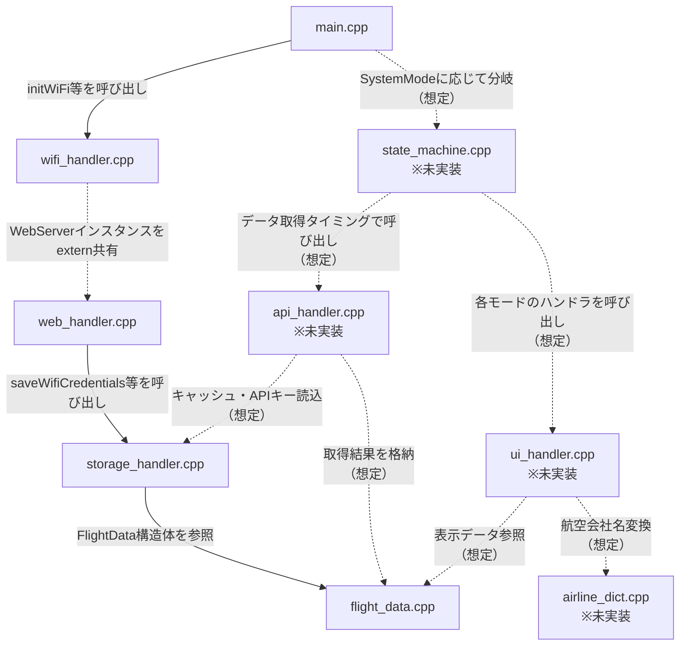

# プロジェクト仕様書：M5Stack 航空機スキャンシステム

**更新日時：2026-08-13**

本仕様書は、M5Stack（ESP32）を使用した「位置情報を基準にした周辺航空機のライブスキャンシステム」の開発プロジェクト仕様をまとめたものである。
APIとして「AirLabs API」を採用し、Wi-Fi接続のハードコーディング回避策やデバイス上でのパース・表示処理について定義する。

---

## 0. 前提条件

- **開発環境**：VS Code + PlatformIO
- **対象デバイス**：M5Stack Basic
  （ただし、開発中の機材都合により M5Stack CoreS3 を使用するケースがあり、両機種で動作する共通コードとして開発する。7.0.2・7.2参照）

### 0.1 M5Stack Basic 主な仕様

| 項目 | 内容 |
|---|---|
| コアコントローラ | ESP32 IoTチップ（デュアルコア、低消費電力設計、Wi-Fi統合） |
| ストレージ | 16MB SPIフラッシュメモリ内蔵 |
| ディスプレイ | 2.0インチ IPSディスプレイパネル（ILI9342C、320×240ピクセル） |
| インターフェース | 物理ボタン×3、スピーカー、Type-C USB、Grove（I2C）ポート、TFカード（microSD）スロット |
| 電源管理 | リチウムバッテリー内蔵、電源管理IC（IP5306）搭載 |
| 拡張性 | 上下分離式構造、下部にM5-Busソケットおよび拡張ピン（2X15 BUS） |

**Basic を採用する理由**：
BasicとGrayの違いは「9軸IMU（加速度・ジャイロ・磁気センサ）」の有無のみで、CPU・メモリ・画面・Wi-Fi・ボタンは同一である。方位情報はAirLabs APIのレスポンス（`dir`）から取得するため、本体センサーは不要である。よってBasicで機能要件を満たす。

---

## 1. システム概要
本システムは、M5Stackを用いて、指定した現在地（緯度・経度）を中心とする周辺空域を飛行中の航空機情報を取得し、ディスプレイに表示するガジェットである。

### 💡 運用上の特徴
* **非リアルタイム運用**: 常時データを更新するのではなく、1日に数回、ユーザーが「見たいとき」にM5Stackの物理ボタンを押す、または特定のトリガーによって情報を手動更新（同期）するスタイルをとる。これによりAPIの無料枠制限（月1,000回）を最適に運用する。
* **低消費電力運用**: Wi-Fiは常時接続せず、通信が必要なタイミングのみ接続する（詳細は3.5参照）。

### 1.1 起動時シーケンス

M5Stack起動時（プログラム起動時）は、以下の順序で判定・処理を行い、最終的に機体情報表示フロー（5.2参照）へ遷移する。この一連のシーケンスの間はWi-Fiを ON にした状態で進行する（3.5参照）。

```
[ 起動 ]（Wi-Fi ON）
  │
  ▼
[ Wi-Fi接続可能か？ ]
  │
  ├─► No → [ Wi-Fi接続処理へ（3.1参照） ]
  │
  ▼（Yes、または接続完了後）
[ APIキー登録済みか？ ]
  │
  ├─► No → [ APIキー登録フロー ]（3.4参照）
  │
  ▼（Yes、または登録完了後）
[ 取得地点登録済みか？ ]
  │
  ├─► No → [ 取得地点登録フロー ]（4.2参照）
  │
  ▼（Yes、または登録完了後）
[ 機体情報取得済みか？ ]
  │            ※起動直後でも、デバイス本体にキャッシュが
  │             残っていれば「取得済み」と判定する（2.4参照）
  ├─► No → [ 機体情報取得（AirLabs APIへリクエスト）]
  │
  ▼（Yes、またはキャッシュ利用／新規取得完了後）
[ 機体情報表示フローへ ]（5.2参照、以降はWi-Fi OFF）
  │
  ▼
[ 機体情報表示 ]（旧「簡易表示」。5.3参照）
```

**判定ポイントの補足：**
* **APIキー登録**：初回起動時に未登録の場合はこのフローで登録を行う。登録後は設定画面（BtnC経由）からいつでも変更可能とする（3.4参照）。
* **取得地点登録**：初回起動時に未登録の場合はこのフローで、航空機情報取得の基準となる緯度経度を登録する。登録後は設定画面（BtnC経由）からいつでも変更可能とする（4.2参照）。
* **機体情報取得済みか？**：起動直後であっても、デバイス本体にキャッシュされた前回取得分のデータが残っていればそれを使用し、新規のAPIリクエストは発生させない（2.4参照）。キャッシュが存在しない場合のみ新規取得を行う。
* **初回設定完了後のデータ取得**：確認ダイアログ（5.7.2参照）は挟まず、直接データ取得へ進む。キャッシュがなくデータ取得が必然であり、「意図しない副作用のある操作」に該当しないためである。

---

## 2. API仕様 (AirLabs API)
周辺航空機データの取得には、データの正確性と豊富な付加情報（航空会社名や発着空港など）を兼ね備えた **AirLabs API**（無料プラン）を使用する。

* **ベースURL**: `https://airlabs.co/api/v9/flights`
* **無料枠制限**: 月間 1,000 リクエスト（1日平均 約33回スキャン可能）
* **範囲指定方式**: 境界ボックス (Bounding Box / `bbox`) を指定

### 2.1 クエリパラメータの構成例

基準地点が「緯度 y, 経度 x」である場合、設定された`SCAN RANGE`（5.7参照）に応じたマージンを設定し、以下のように4点の緯度経度範囲を生成してリクエストする。

* **南端（lamin）** = y - マージン
* **北端（lamax）** = y + マージン
* **西端（lomin）** = x - マージン
* **東端（lomax）** = x + マージン

**SCAN RANGE の設定値：**

| 表示ラベル | マージン | おおよその範囲（北緯35度付近） |
|---|---|---|
| `NARROW`（初期値） | ±0.5度 | 南北 約111km / 東西 約91km |
| `WIDE` | ±2.0度 | 南北 約444km / 東西 約364km |

* 初期値は`NARROW`とする。日中は狭い範囲でも保持上限（10機、2.3参照）が埋まるため、初回起動時や設定ミス時に大量取得となるリスクを避けられる。
* 設定値はLittleFS + JSONに保存する（4.3と同様の方式）。

### 2.1.1 レスポンスサイズの削減（`_fields`）

レスポンスのサイズ・パース時間・メモリ使用量を抑えるため、`_fields`パラメータで返却フィールドを限定する。

**`_fields`（採用確定）：**
返却するフィールドをカンマ区切りで指定し、本システムで使用しない項目を除外する。フルレスポンスは21フィールド前後だが、本システムで使用するのは以下の12フィールドのみであるため、**レスポンスサイズは約半分に削減**できる見込みである。

```text
_fields=flight_icao,flight_iata,airline_icao,aircraft_icao,dep_iata,arr_iata,lat,lng,alt,dir,speed,squawk
```

**`_view=array`（採用保留・実測後に判断）：**
キー名を含まない配列形式で返却させるパラメータ。キー名（1件あたり100バイト以上）が省かれるため、`_fields`との併用でレスポンスサイズを3分の1〜4分の1程度まで削減できる可能性がある。

ただし、以下の懸念があるため、現時点では採用を保留とする。

* 値が存在しないフィールド（例：貨物便・チャーター便・正体不明機など、スケジュールデータが紐付いておらず`dep_iata`/`arr_iata`が欠ける場合）がある際に、
  * **パターンA**：該当位置に`null`等を入れて要素数を維持する → 項目ずれは発生しない
  * **パターンB**：値のない項目を詰めて可変長で返す → **項目ずれが発生し、値の取り違えを招く**
* AirLabsのドキュメント記載例からはパターンAと推測されるが、確証がない。

**判断方法**：`_view=array`＋`_fields`を指定し、発着地情報が欠けている機体を含むレスポンスを実際に取得して、要素数が他の機体と一致するかを確認する。パターンAであることが確認できた場合に採用する。

`_fields`単独でも約半分の削減効果が得られるため、`_view=array`を採用しない場合でも、メモリ面の懸念（特に`SCAN RANGE`がWIDEの場合）は相当程度緩和される。

**その他のパラメータについて：**
リクエストパラメータには`zoom`（地図描画向けの間引き、0〜11）も存在するが、本システムでは使用しない。AirLabsの公式ドキュメントには間引きの具体的な基準が記載されておらず、**基準地点からの距離が考慮されるかどうかが不明**なためである。「近い順に10機」を表示する本システムでは、頭上を飛行する機体が間引かれてしまうと目的を果たせない。挙動が保証されない以上、`bbox`による範囲指定のみで制御する方針とする。

※一般に航空レーダー系APIでは、機体サイズ・運航目的、航空会社の規模、スケジュールデータの充実度などを基準に間引きが行われるとされるが、これはAirLabs公式の情報ではなく推測の域を出ない。仮にこの基準であれば距離は考慮されないことになり、なおさら本システムには適さない。

**リクエストURLイメージ（`NARROW`、基準地点が緯度34.979406600554526・経度138.38317272541366の場合）:**
```text
https://airlabs.co/api/v9/flights?api_key=YOUR_API_KEY&bbox=34.479406600554526,137.88317272541366,35.479406600554526,138.88317272541366&_fields=flight_icao,flight_iata,airline_icao,aircraft_icao,dep_iata,arr_iata,lat,lng,alt,dir,speed,squawk&lang=en
```

### 2.1.2 HTTPS通信の証明書検証について

AirLabs APIとのHTTPS通信では、`WiFiClientSecure::setInsecure()`により証明書検証を省略する方針とする。

**理由：**
* AirLabsは独自のルートCA証明書を公式配布しておらず、`setCACert()`による検証を行うには証明書の入手・維持に見合わない手間がかかる
* 本システムが扱うデータ（航空機の位置情報等）は機密性が低く、中間者攻撃のリスクを許容できる
* ESP32側での証明書チェーンの管理・更新コストを避けられる

この方針は、AirLabs APIへの通信全般（周辺機体スキャン、APIキー検証（3.4.1参照）等）に適用する。

**実装上の注意：**

`HTTPClient::begin(url)`にHTTPS URLを直接渡す書き方（`WiFiClientSecure`を介さない）は、arduino-esp32のコミュニティ内でバージョン依存の不安定な挙動が報告されている。本システムでは、`WiFiClientSecure`のインスタンスを明示的に生成し、`begin(client, url)`の形でクライアントを渡す方式に統一する。**3.4.1節のサンプルコードは実装時に本方針に合わせて修正すること。**

### 2.2 レスポンスデータ構造とM5Stackでのマッピング
AirLabsから返却されるJSONデータから、以下のキーをパースして表示を行う。

| JSONキー | 取得データ | 単位/形式 | 表示・処理内容 |
|---|---|---|---|
| `flight_icao` | 便名（ICAOコード） | 例: "SKY598" | **画面上部にメイン表示**。あわせてFlightAware用URL（`https://flightaware.com/live/flight/{flight_icao}`）のQRコード[^1]生成にも使用（5.3参照） |
| `flight_iata` | 便名（IATAコード） | 例: "BC598" | `flight_icao`が取得できない場合のフォールバック表示 |
| `airline_icao` | 航空会社 3レターコード | 例: "SKY" | コードから航空会社名（例: Skymark Airlines）へ変換（内部辞書を使用、5.3.1参照） |
| `aircraft_icao` | 機種 | 例: "B789" | 機種の表示 |
| `alt` | 飛行高度 | メートル (m) | 高度計風に表示。※取得できない(null/0)場合のエラー処理が必要 |
| `speed` | 対地速度 | km/h | 速度表示 |
| `dir` | 進行方向 | 度数 (0〜360°) | 8方位の英字表記に変換して表示（2.3.1参照） |
| `dep_iata` | 出発空港コード | 3レター (例: "OKA") | 出発地の表示 |
| `arr_iata` | 到着空港コード | 3レター (例: "UKB") | 到着地の表示 |
| `lat` / `lng` | 機体の緯度・経度 | 度数 | 基準地点からの距離計算に使用（2.3参照）。構造体には保持しない |
| `squawk` | スコーク（トランスポンダコード） | 4桁の数字 (例: "7500") | レスポンスに含まれる場合のみ表示（5.4・5.6参照）。含まれない場合はプレースホルダ表示 |

**便名のメイン表示にICAOコードを採用する理由：**
* 画面に表示される便名（例：`JAL35`）と、QRコードから遷移するFlightAwareのURL（`.../flight/JAL35`）が一致し、利用者にとって整合的である。
* ICAOコードは航空会社が3レターで明示されるため、辞書変換した航空会社名との対応も分かりやすい。
* ただし機体によっては`flight_icao`が取得できない場合があるため、その際は`flight_iata`にフォールバックする。

**航空会社辞書のキーにICAOコードを採用する理由：**
* 辞書データ（`airline_icao.csv`、964社）がICAOコードをキーとして構成されているため。
* IATAコード（2レター）は重複や再割り当てが起こりやすいのに対し、ICAOコード（3レター）は識別子としてより安定している。

※ `squawk`（スコーク／トランスポンダコード）はAirLabsのAPI仕様上は定義されているが、`_fields`を指定しない状態での実測でも、確認できた例はほとんどない。恒常的に含まれないのではなく、**含まれることがごくまれ**（緊急事態時など特定の状況でのみ送出される等）と推測される。安定して取得できる項目ではないため、`_fields`には含めた上で、レスポンスに含まれる場合のみ表示する方針とする（5.4参照）。
※ `status`（運航ステータス）はレスポンスに含まれるが、bboxスキャンは「指定範囲内を現在飛行中の機体」を返す仕様上、取得できる機体はほぼすべて`en-route`となる。全機体で同じ値となり情報価値がないため、表示対象としない（5.4参照）。

### 2.2.1 実測で確認済みのレスポンスキー一覧（参考）

実際のAPIレスポンスで確認済みのキーは以下の通り。2.2表に記載のもの以外にも多数のキーが含まれており、今後の表示項目拡張時の参考とする。

**周辺機体スキャン（bbox指定、`/flights`）のレスポンスに含まれるキー：**
`hex`, `reg_number`, `flag`, `lat`, `lng`, `alt`, `dir`, `speed`, `flight_number`, `flight_icao`, `flight_iata`, `dep_icao`, `dep_iata`, `arr_icao`, `arr_iata`, `airline_icao`, `airline_iata`, `aircraft_icao`, `status`

**参考：ICAOコード指定でのフライト情報取得（`/flight`、本プロジェクトでは不使用）**

現行方針（5.3参照）ではICAOコード指定でのAPI再コールは行わず、詳細情報はFlightAwareのWebページを案内する方式とした。参考として、AirLabsの当該エンドポイント（`https://airlabs.co/api/v9/flight?flight_icao={ICAOコード}&api_key=YOUR_API_KEY`）を利用した場合に追加で取得できる主なキーを以下に残す。

`dep_terminal`, `dep_gate`, `dep_time`, `dep_estimated`, `dep_actual`, `arr_terminal`, `arr_gate`, `arr_time`, `arr_estimated`, `eta`, `model`（機種正式名称）, `manufacturer`, `engine_count`, `dep_city`, `dep_country`, `arr_city`, `arr_country`, `airline_name`

### 2.3 航空機データの内部保持構造

複数機分のデータを構造体配列で保持する。メモリ検証済み：10機分保持しても1KB未満で問題ない。

※構造体名は当初`AircraftData`としていたが、画面表記（`FLIGHT_VIEW`、`No flights found.`）およびファイル名（`flight_data.h`、7.1参照）との一貫性を優先し、`FlightData`に変更した。関連する変数名（`foundFlights`、`totalFlightCount`）も同様に統一している。

```cpp
#define MAX_FLIGHT_COUNT 10   // 保持する機体データの上限

struct FlightData {
    String callsign;      // 便名（flight_icao。取得できない場合はflight_iataをフォールバック）
    String flightIcao;    // 便名ICAOコード（FlightAware用URL生成に使用）
    String airlineIcao;   // 航空会社ICAOコード（航空会社辞書の検索キー、5.3.1参照）
    double dist;           // 基準地点からの距離（km）
    int alt;                // 高度
    String from;           // 出発地
    String to;              // 到着地
    String type;            // 機種
    int speed;              // 巡航速度
    int heading;            // 方位
    String squawk;          // スコーク（レスポンスに含まれない場合は空文字。5.4参照）
};

FlightData foundFlights[MAX_FLIGHT_COUNT];
int totalFlightCount = 0;
int currentDisplayIndex = 0;
```

取得した複数機のデータは、基準地点からの距離順にソート（バブルソート）して保持する。

**`lat`/`lng`を構造体に保持しない理由：**
機体の緯度経度は距離計算にのみ使用し、JSONパース時にローカル変数として受け取ってその場で`dist`を算出する。本システムは基準地点が固定（2.3.1参照）であり、取得後に距離を再計算する必要がないため、座標そのものを保持する必要はない。

```cpp
// JSONパースのループ内で、その場で距離を算出して dist に格納する
double lat = flight["lat"];
double lng = flight["lng"];
aircraft.dist = TinyGPSPlus::distanceBetween(baseLat, baseLng, lat, lng) / 1000.0;
// lat/lng はこの時点で役目を終えるため、構造体には保持しない
```

※将来的に「基準地点から見た機体の方角表示」「簡易レーダー表示」「基準地点変更時のキャッシュ再計算」等の機能を追加する場合は、座標の保持が必要になる。

**欠損値の内部表現ルール：**

APIレスポンスに該当データが含まれない場合、`FlightData`構造体の各メンバーは以下の値で欠損を表現する。

| 項目種別 | 対象項目 | 欠損時の値 | 理由 |
|---|---|---|---|
| 文字列 | `callsign`, `flightIcao`, `airlineIcao`, `from`, `to`, `type`, `squawk` | 空文字`""` | 表示側でプレースホルダ（`---`）に変換する（5.4参照） |
| 数値（例外） | `alt`, `speed`, `heading` | `-1` | `0`が地上停止・低速走行・真北等の**正常値**でありうるため、欠損と区別する必要がある |

* `alt`：2.2節に記載の「取得できない(null/0)場合のエラー処理が必要」という要求を、この`-1`センチネル方式で具体化したもの。
* `speed`：`alt`と同様、地上停止・低速走行時に`0`が正常値として発生しうるため、同方式を採用する。
* `heading`：`0`度（真北）は正常値のため、`-1`を欠損値とする。

### 2.3.1 距離・方位の計算方法

AirLabs APIのレスポンスには、基準地点（取得地点）から各機体までの距離は含まれないため、各機体の`lat`/`lng`と基準地点の緯度経度から自前で計算する。

* **距離計算**：**`mikalhart/TinyGPSPlus`ライブラリ**の静的関数`distanceBetween()`を流用する。
  * GPSモジュール自体は使用しないが、当該ライブラリが内部でHaversine公式（球面三角法）による2点間距離計算を実装しているため、その部分のみを部品として流用する。
  * 自前でHaversine公式を実装する案もあったが、既存ライブラリの実績を優先し、ライブラリ流用を採用した。
  * 呼び出し例：`double dist = TinyGPSPlus::distanceBetween(lat1, lng1, lat2, lng2);`（静的関数のため、インスタンス化は不要）
* **距離の単位・表記**：**km表記**とする（当初はm表記も検討したが、想定スキャン範囲（2.1参照：半径115〜120km相当）との整合を考慮し、km表記に統一した）。
* **方位表示**：取得した`dir`（進行方向、度数）を8方位の英字表記（N/NE/E/SE/S/SW/W/NW）に変換して表示する。日本語フォント・矢印記号（Unicode）は、メモリ・実装負荷の観点、およびデフォルトフォントが矢印記号（U+2190〜U+21FF等）に対応していないことから採用しない。

```cpp
const char* getDirectionLabel(float heading) {
  int index = (int)((heading + 22.5) / 45.0) % 8;
  const char* directions[] = {"N", "NE", "E", "SE", "S", "SW", "W", "NW"};
  return directions[index];
}
```

* **基準地点**：現時点では固定座標（4章で登録した取得地点）を使用する。GPSモジュールによる動的取得（現在地追従）は将来的な検討事項とし、現時点では対応しない。

### 2.4 機体情報キャッシュ仕様

APIリクエスト回数（無料枠：月1,000回）を節約するため、直近で取得した機体情報をデバイス本体にキャッシュし、起動時に再利用する。

* **キャッシュの利用判定**：起動時、デバイス本体にキャッシュが残っている場合は「機体情報取得済み」と判定し、新規のAPIリクエストを行わずキャッシュデータをそのまま機体情報表示フローへ渡す（1.1参照）。
* **キャッシュが無い場合**：初回起動時など、キャッシュが存在しない場合のみ新規にAPIリクエストを実行する。
* **キャッシュの更新**：ユーザーが手動で再取得操作（5.2参照）を行った場合、新規取得したデータでキャッシュを上書きする。
* **保存方式**：**LittleFS + JSON**（`bblanchon/ArduinoJson`を使用）に保存する。取得地点情報（4.3参照）と同様の方式であり、**同じ`ArduinoJson`ライブラリで読み書きできる**（AirLabs APIのレスポンス解析にも同ライブラリを使用しているため、新たな解析処理を追加せずに済む）。機体情報はセキュリティ上重要度が低いデータであるため、NVS（非公開領域）ではなくLittleFS上にテキスト形式で保存する方針とする。データ量は最大10機分でも1KB未満であり、パフォーマンス上NVSを用いる必然性はない。

**関数インターフェースの設計方針：**

保存・読み込み処理は、データ種別ごとに個別の関数を用意する方式とする（Wi-Fi資格情報／APIキー／設定値／機体情報キャッシュをそれぞれ個別関数化）。

* `saveWifiCredentials()` / `loadWifiCredentials()` / `clearWifiCredentials()`
* `saveApiKey()` / `loadApiKey()` / `clearApiKey()`
* `saveConfig()` / `loadConfig()` / `clearConfig()`
* `saveCache()` / `loadCache()` / `clearCache()`

静的IP設定・取得地点・SCAN RANGEは、以下の`ConfigData`構造体にまとめて`config.json`と対応させる。

```cpp
struct ConfigData {
    bool useStaticIp;   // true: 静的IP, false: DHCP
    String staticIp;    // M5Stack自身のIP
    String gateway;     // ゲートウェイ
    String subnet;      // サブネットマスク
    String dns;         // DNSサーバー（未入力時はgatewayを流用）
    double lat;          // 取得地点：緯度
    double lng;          // 取得地点：経度
    String scanRange;    // "NARROW" または "WIDE"
};
```

### 2.4.1 保存ファイルの分割とフラッシュ書き込み回数の低減

ESP32のフラッシュメモリには書き込み回数の上限（一般に10,000〜100,000回程度）がある[^2]。NVS・LittleFSはいずれも同一のフラッシュ上に構築されるため、どちらも制限の対象となる。

本システムでは機体情報を1日最大33回程度（無料枠の上限に相当）書き込む可能性があるため、以下の方針で書き込み回数を抑える。

**ファイル構成：**

```
data/
├── config.json    ← 設定値（取得地点・SCAN RANGE・静的IP設定）
└── cache.json     ← 機体情報キャッシュ＋残りリクエスト数
```

| ファイル | 書き込み頻度 | 対策 |
|---|---|---|
| `config.json` | 低い（設定変更時のみ） | **差分がある場合のみ書き込む** |
| `cache.json` | 高い（データ取得のたび） | 機体情報と残りリクエスト数を**1ファイルに統合**し、書き込み回数を2回→1回に半減 |

* **ファイルを分ける理由**：設定値がキャッシュの高頻度な書き込みに巻き込まれないようにするため。
* **差分チェックの実装**：保存前に生成したJSON文字列と既存ファイルの内容を比較し、一致する場合は書き込みをスキップする。読み込みは摩耗の対象外であるため、追加コストは実質的にない。

```cpp
// 保存対象のJSON文字列を生成
String newJson;
serializeJson(doc, newJson);

// 既存ファイルの内容を読み込んで比較する
File file = LittleFS.open("/config.json", "r");
String currentJson = file ? file.readString() : "";
if (file) file.close();

// 内容が同じなら書き込まない
if (newJson == currentJson) {
    return;
}

// 差分がある場合のみ書き込む
file = LittleFS.open("/config.json", "w");
file.print(newJson);
file.close();
```

* **`cache.json`には差分チェックが効かない**（取得のたびに内容が変わるため）。機体情報を蓄積せず常に上書きする性質上、RAMに溜めて一括保存する手法も適用できない。
* **将来的な選択肢**：書き込み回数が問題となる場合、`cache.json`のみmicroSDへ移すことも可能（追加工数8〜13時間の見込み）。ただしHTMLファイルは、SDカード未挿入時に設定画面を開けなくなり復旧不能となるため、LittleFSに残す必要がある。

* **実装の詳細**（保存先ファイル名、JSON構造等）は実装時に確定する。

**書き込み失敗時の扱い：**

`config.json` / `cache.json`への書き込みが失敗した場合（`LittleFS.open()`の失敗等）、専用のエラー画面は新設しない。`Serial.println()`によるログ出力と、保存関数の戻り値`false`判定のみで対応する（納期を優先した判断）。

### 2.5 残りリクエスト数の保持

AirLabs APIのレスポンスには、無料枠に対する残りリクエスト数の情報が含まれる。この値をデバイス側で保持し、ユーザーが確認できるようにする。

* **取得タイミング**：AirLabs APIへのリクエストが成功するたびに、レスポンスに含まれる残りリクエスト数の値で上書き保持する（常に最後に取得した値を保持する）。
* **保存方式**：機体情報キャッシュ（2.4参照）・取得地点情報（4.3参照）と同様、LittleFS + JSONに保存する（変更可能性あり）。
* **参照方法**：設定内容一覧画面（CONFIG）から参照できるようにする（5.7.1参照）。表記は `842 left` の形式とする。

---

## 3. ネットワーク設定仕様（Wi-Fi接続・APIキー・静的IP）

SSIDやパスワードをソースコードに直接書き込まないようにするため、デバイス上のWebページから設定を登録する方式を採用する。

### 3.0 実装方針：WiFiManagerを使用せず自前実装とする（確定）

当初は`WiFiManager`ライブラリ（`tzapu/WiFiManager`）の採用を予定していたが、以下の既知の不具合・制約により、**ESP32の標準機能を用いた自前実装に変更する**。

**WiFiManagerを採用しない理由：**

| 問題 | 内容 | 出典 |
|---|---|---|
| DNS解決失敗 | ESP32で静的IPを設定すると、Wi-Fiには繋がるが`hostByName(): DNS Failed`が発生し、外部APIと通信できなくなる。`setSTAStaticIPConfig()`の第4引数でDNSを指定しても、ESP32内部コア（LWIP）へ正しく渡されない、またはDHCP側の空DNSに上書きされる | Issue #1362 |
| 静的IPが保存されない | SSID/パスワードは自動でNVSに保存されるが、Webポータルから入力した静的IP設定は保存されず、再起動でコード内のデフォルト値またはDHCPに戻る | Issue #1578、#1269 |
| 静的IPフィールドの実装不備 | 組み込みの静的IP入力機能（`setShowStaticFields()`）に実装上の問題が指摘されている | Issue #1733 |
| ポータルが自動表示されない事例 | ESP32環境でキャプティブポータル[^3]がポップアップしない報告がある | Issue #553 |
| APモード移行時の競合 | 静的IP設定が有効なままWi-Fi接続に失敗すると、APモード（192.168.4.1）で立ち上がった際に内部ルーティングテーブルが競合し、設定ポータルにアクセスできなくなる可能性がある | - |

**本プロジェクトへの影響が大きい理由：**
* 本システムはAirLabs API（`airlabs.co`）、NTP（`ntp.nict.jp`）、いずれもホスト名でアクセスするため、DNS解決失敗は致命的である。
* **静的IP対応は必須要件**である（DHCPのないネットワーク環境で開発作業およびデモンストレーションを実施する予定のため）。
* デモンストレーションでの確実な動作が求められるため、ライブラリ内部の挙動と回避策が干渉するリスクを排除したい。

**自前実装の妥当性：**
* WiFiManager自身も、ESP8266 Arduino公式の`DNSServer/examples/CaptivePortalAdvanced`を土台としており、同じ仕組みを標準機能で構築できる。
* WiFiManagerを使う場合も、DNS再適用・自前保存・APモード時のIP設定クリアといった回避策の実装が必要となり、工数差は限定的である。
* 実装の全体を把握でき、意図した通りに動作させられる。

**使用するAPI（すべてESP32標準）：**

| 処理 | 使用API |
|---|---|
| APモード起動 | `WiFi.softAP()` |
| キャプティブポータル | `DNSServer` |
| HTML配信・フォーム受信 | `WebServer`（標準。`ESPAsyncWebServer`は使用しない） |
| 静的IP適用 | `WiFi.config()` |
| 接続 | `WiFi.begin()` |
| 資格情報の保存 | `Preferences`（NVS） |
| ネットワーク情報の保存 | LittleFS + JSON |

### 3.1 初期設定フロー

```
[ 起動 ]
  │
  ▼
[ 保存済みのWi-Fi資格情報・ネットワーク情報を読み込み ]
  │
  ├─► 【登録あり】
  │      │
  │      ▼
  │    [ 保存済みの接続方式（DHCP／静的）を判定し、静的の場合は WiFi.config() で適用（3.7参照） ]
  │      │
  │      ▼
  │    [ WiFi.begin() で接続試行（タイムアウトあり） ]
  │      │
  │      ├─► 【成功】 → WiFi.config() でDNSを再適用（3.7参照）
  │      │              → 接続成功画面（5.9参照） → APIキー登録判定へ（1.1参照）
  │      │
  │      └─► 【失敗】 → 接続失敗画面（5.9参照） → APモードへ
  │
  └─► 【未登録】
         │
         ▼
       [ APモードへ移行（SSID: "M5Stack-AP"）]
         │  ※移行前に WiFi.config() で静的IP設定をクリアする（3.7参照）
         │
         ├─ AP接続案内画面を表示（5.9参照）
         │
         ▼
       [ スマートフォン等が「M5Stack-AP」に接続 ]
         │  ※キャプティブポータル機能により設定用Webページが自動的に開く（3.2参照）
         ▼
       [ 設定用WebページでWi-Fi資格情報・ネットワーク情報を入力・送信 ]
         │  ・SSID / パスワード
         │  ・接続方式（DHCP／静的）
         │  ・M5Stack IP / Gateway / Subnet / DNS（「静的」選択時のみ、3.7参照）
         ▼
       [ 入力値を保存し、APモードを終了して接続試行 ]
         │  ・Wi-Fi資格情報 → NVS（3.3参照）
         │  ・ネットワーク情報 → LittleFS + JSON（3.7参照）
         ▼
       [ 接続成功 ] → 接続成功画面 → APIキー登録判定へ（1.1参照）
```

### 3.1.1 異なるネットワークへの切り替えフロー

設定済みの接続先とは別のネットワークへ切り替える場合の流れ。

```
[ 登録されている接続情報での接続に失敗 ]
  │  （または設定メニューの「Wi-Fi」を選択）
  ▼
[ 確認ダイアログを表示（5.7.2参照）]
  │  「Change Wi-Fi settings?」
  │  「The current connection will be disconnected.」
  │
  ├─► 【CANCEL】 → 元の画面へ戻る
  │
  └─► 【CONFIRM】
         │
         ▼
       [ 保存されている接続関連情報をクリア ]
         │  ・NVSのWi-Fi資格情報
         │  ・LittleFSのネットワーク情報（静的IP設定）
         │  ・実行中のIP設定（WiFi.config() でクリア）
         ▼
       [ APモードへ移行 ]（3.1の未登録時と同じフロー）
```

### 3.1.2 Wi-Fi接続失敗時のリトライ仕様

Wi-Fi接続に失敗した場合、初回の自動接続試行に加え、利用者が手動で**最大2回まで**再試行（RETRY）できるようにする。

**背景：** 屋外でスマートフォンのテザリング回線を使用する運用を想定した機能。当初は「テザリング電波用スマートフォン」と「M5Stackへの設定登録用スマートフォン」の2台体制を想定していたが、手動リトライがあれば、1台のスマートフォンで「テザリングOFF→M5StackのAPに接続してWi-Fi情報登録→テザリングON（元の回線へ戻す）」という運用が可能になり、2台目のスマートフォンが不要になる。

**試行回数の数え方：**

| 試行 | 内容 |
|---|---|
| 1回目 | フォーム送信後の自動接続試行 |
| 2回目 | 1回目失敗後、`RETRY`ボタン押下による再試行 |
| 3回目（上限） | 2回目失敗後、`RETRY`ボタン押下による再試行 |

3回目も失敗した場合、`RETRY`ボタンは表示されなくなり、`BACK`のみとなる（入力フォームへ戻り、SSID・パスワード等を入力し直す）。

**対象範囲：**

| フロー | リトライ機構 |
|---|---|
| `WIFI_SETUP_INIT`（初回起動時） | **対象**（本節の仕様を適用） |
| `WIFI_SETUP_SETTINGS`（SETTINGS画面からのWi-Fi再設定） | **対象**（本節の仕様を適用） |
| `WIFI_SETUP_RECONNECT`（機体情報再取得時のWi-Fi接続失敗からの復帰） | **対象外**。失敗時は`BACK`のみとし、SETTINGS画面から改めてWi-Fi再設定を行う運用とする |

**画面表示：**

* ボタンは`RETRY`／`BACK`のどちらか一方のみを表示する（両方同時には表示しない）。
  * リトライ上限内：画面右側に`RETRY`のみ表示
  * リトライ上限到達後：画面左側に`BACK`のみ表示
* 画面内に、現在のリトライ回数を`Retry ○/○`の形式で表示する（例：`Retry 0/2`）。
  * カウントは「消費した手動リトライ回数／上限」であり、初回の自動接続試行はカウントに含めない。
  * 上限到達時は`Retry 2/2`と表示された状態でBACKのみに切り替わる。

**実装上の留意点：**

* リトライ回数を保持するカウンタ変数（例：`int wifiRetryCount`）を用意し、接続試行のたびにインクリメントする。
* カウンタは、`/save`受信時（`handleSave()`の冒頭、フォーム送信による1回目の接続試行の直前）にリセットする。`RETRY`ボタンによる再試行は`/save`を経由しないため、カウンタはリセットされずインクリメントされ続ける。
* `WIFI_SETUP_FAILED_*`画面の描画時、カウンタの値に応じて`RETRY`ボタンの表示有無・`Retry ○/○`表示を切り替える。

### 3.2 キャプティブポータルの実装

APモード移行時、スマートフォン等が「M5Stack-AP」に接続すると、設定用Webページが自動的に開くようにする。

**仕組み：**
1. `DNSServer`を起動し、**全ドメインへのDNS問い合わせに自機のIP（`192.168.4.1`）を返す**。これにより、接続した端末がどのURLを開こうとしてもM5Stackにアクセスが来る。
2. 各OSは接続直後に、インターネット接続を確認するための特定URL（Androidは`generate_204`、iOSは`hotspot-detect.html`等）へHTTPアクセスする。
3. これらのアクセスに対し**HTTP 302で設定ページへリダイレクト**を返すと、OSは「ログインが必要なネットワーク」と判断し、設定画面を自動的にポップアップ表示する。

```cpp
#include <DNSServer.h>
#include <WebServer.h>
#include "secrets.h"    // AP_SSID / AP_PASSWORD（Git管理外）

DNSServer dnsServer;
WebServer server(80);   // HTTPのみ。HTTPSは扱わない

void enterAPMode() {
    WiFi.softAP(AP_SSID, AP_PASSWORD);

    // 全ドメインへのDNS問い合わせに自機IPを返す
    dnsServer.start(53, "*", WiFi.softAPIP());

    server.on("/", handleSetupPage);
    server.on("/save", HTTP_POST, handleSave);

    // 未登録パスは全て設定ページへ302リダイレクト（OS別URLを個別対応しない）
    server.onNotFound([]() {
        server.sendHeader("Location", "/", true);
        server.send(302, "text/plain", "");
    });

    server.begin();
}

void loop() {
    dnsServer.processNextRequest();   // DNS要求の処理（ループ内で必要）
    server.handleClient();             // HTTP要求の処理
}
```

**実装上の留意点：**
* **OS別のURLを個別に登録しない**。`onNotFound()`で一括リダイレクトすれば、OSやバージョンによるURLの差異を意識せずに済み、保守性が高い。
* **HTTPSは扱わない**（ポート80のみ）。未認証時にHTTPS通信を302リダイレクトすると証明書エラー（警告画面）が発生するため、HTTPのみをフックする。
* **設定完了後は必ずAPを停止する**。停止し忘れると、APが立ち続けて他の端末が誤接続する可能性がある。

```cpp
// 設定完了後のAP停止処理
void exitAPMode() {
    dnsServer.stop();
    server.stop();
    WiFi.softAPdisconnect(true);
}
```

* DNSServerが応答するのはM5Stack-APに接続した端末のみであり、他のネットワーク上の端末に影響を与えることはない。

### 3.3 資格情報の保存方式

| 情報 | 保存先 | 理由 |
|---|---|---|
| SSID / パスワード（ユーザーが接続する先） | **NVS（Preferences）** | ソースコードへの直接記述（ハードコーディング）を避け、NVS領域に保存する。通常のプログラム経由では値が露出しない形とするが、フラッシュの物理的な解析等に対する完全な秘匿（NVS暗号化・フラッシュ暗号化）までは本プロジェクトの要件としない |
| APIキー | **NVS（Preferences）** | 同上（3.4参照） |
| 静的IP設定（IP/Gateway/Subnet/DNS） | **LittleFS + JSON** | 秘匿性が低く、デバッグ時に設定値を確認できる方が有用（3.7参照） |
| APモード自体のSSID/パスワード（`M5Stack-AP`） | **ハードコード（`secrets.h`、Git管理外）** | ユーザーが接続する先の資格情報とは異なり、固定・共通の値であり、APが立つのは短時間のみのため、実行時のNVS登録フローは不要と判断。値自体はGit管理外のヘッダファイルに分離し、リポジトリへの直接記述は避ける |

**NVS名前空間の分離：**

Wi-Fi資格情報とAPIキーは、NVS上で名前空間を分離して保存する（`wifi` / `api`）。

* **理由**：`Preferences::clear()`は名前空間単位での全消去となるため、名前空間を分けておくことで、Wi-Fi再設定時（3.1.1参照）にAPIキーを残したまま、Wi-Fi資格情報のみを消去することができる。

### 3.4 APIキー登録仕様

AirLabs APIキーについても、Wi-Fi資格情報と同様にソースコードへのハードコーディングを避け、デバイス側での登録方式とする。

* **登録タイミング**：
  1. **初回起動時**：APIキーが未登録の場合、起動時シーケンス（1.1参照）内でAPIキー登録フローへ誘導する。
  2. **設定画面から変更**：登録済みの場合でも、BtnC（各種設定画面）経由でいつでも再登録・変更できるようにする。
* **保存方式**：Wi-Fi資格情報と同様、ESP32のNVS（Preferences領域）に保存する。

**登録フロー：**

```
[ 設定用Webページへのアクセス用QRコードを画面表示 ]
  │
  ▼
[ スマートフォン等でQRコードを読み取り ]
  │  ※M5Stackと同じネットワークに接続した端末から読み取る
  ▼
[ 設定用WebページでAPIキー文字列を入力して登録 ]
  │
  ▼
[ 入力したAPIキーをM5Stack本体へ送信・保存 ]
  │
  ▼
[ 以降、登録されたAPIキーを基準に情報取得を行う ]
```

* この設定用Webページは、M5Stackが**stationモードで自宅Wi-Fi等に接続済みの状態**でホストする。初回設定時のAPモード（3.1参照）とは別の動作であり、QRコードもこの用途専用のものを使用する。
* QRコード表示には、M5Unified（M5GFX）組み込みの`M5.Lcd.qrcode()`を使用する（5.8参照）。

### 3.4.1 APIキーの有効性検証（ping）

入力されたAPIキーが有効かどうかを、AirLabsの`/ping`エンドポイントで検証する。

**検証を行う理由：**
* APIキーは長い英数字列であり、手入力・コピー＆ペースト時に欠落や空白混入が起きやすい。検証がないと「範囲内に航空機が1機もいない」場合と区別がつかず、原因の切り分けが困難になる。
* APIキーには有効期限と月間上限（1,000回）があり、pingで事前に検出できる。

**呼び出しタイミング：**

| タイミング | 実装 | 理由 |
|---|---|---|
| **APIキー設定の直後** | 実装する | 入力ミスを即座に検出できる。消費は1回のみ |
| 起動のたび | 実装しない | 毎回リクエストを消費し無料枠を圧迫する |
| データ取得のたび | 実装しない | リクエスト数が2倍になる |

**判定ロジック：**

HTTPステータスコードに依存せず、**レスポンス本文の`response`フィールドが`"pong"`かどうか**のみで判定する。

```
成功時：{"request":{...},"response":"pong","terms":"..."}
失敗時：{"error":{"message":"Unknown api_key","code":"unknown_api_key"},"terms":"..."}
```

```cpp
// APIキーの有効性を検証する
// 戻り値: true = 有効、false = 無効または通信失敗
bool validateApiKey(const char* apiKey) {
    String url = "https://airlabs.co/api/v9/ping?api_key=" + String(apiKey);

    HTTPClient http;
    http.begin(url);
    int httpCode = http.GET();

    bool isValid = false;

    if (httpCode > 0) {
        String payload = http.getString();

        JsonDocument doc;
        DeserializationError error = deserializeJson(doc, payload);

        if (!error) {
            const char* response = doc["response"];
            isValid = (response != nullptr && strcmp(response, "pong") == 0);
        }
    }

    http.end();
    return isValid;
}
```

**検証結果の表示場所：**

**M5Stack側で検証し、結果をHTMLページとしてブラウザに返す**方式とする。利用者はスマートフォンで入力作業をしている最中であり、結果確認・再入力までスマートフォン上で完結する方が操作の流れが分断されないためである。

```
[HTMLフォームでAPIキー入力・送信]
        ↓
[M5Stackがキーを受け取る]
        ↓
[M5Stackが ping を実行]
        ↓
[結果に応じたHTMLを返す]  ← スマートフォン画面上で完結
        ↓
[成功: 完了ページ / 失敗: エラー＋再入力フォーム]
```

```cpp
// Webサーバー：APIキー送信を受け取るハンドラ
server.on("/api_key", HTTP_POST, []() {
    String apiKey = server.arg("apikey");

    if (validateApiKey(apiKey.c_str())) {
        saveApiKeyToNVS(apiKey);
        server.send(200, "text/html", getSuccessPage());
    } else {
        server.send(200, "text/html", getErrorPage("Invalid API key. Please check and try again."));
    }
});
```

**本体側の画面遷移：**
* 成功画面（本体側）は表示しない。成功通知はスマートフォン側に表示されるため、本体側で重ねて通知する必要性が低い。
* 設定完了を検知したら、次の画面（初回起動時は基準地点設定、設定変更時はSETTINGS）へ自動的に遷移する。

**残りリクエスト数について：**
pingのレスポンスには`key.limits_total`（残りリクエスト数）が含まれるが、**本システムでは使用しない**。残りリクエスト数は機体情報取得時（`/flights`）のレスポンスから取得する（2.5参照）。

### 3.5 Wi-Fi電源管理仕様（低消費電力運用）

本プロジェクトの運用特性（非リアルタイム・1日数回の更新）を踏まえ、Wi-Fiを常時接続しない方針とする。

* **通常時**：Wi-Fi OFF。LCD表示のみで低消費電力運用を行う。
* **起動時**：起動時シーケンス（1.1参照）の間はWi-Fi ONの状態で進行し、機体情報表示フローに入った時点でOFFにする。
* **再取得操作時**：ユーザーが再取得を実行した（最終機体で`NEXT`を押し、確認ダイアログで`CONFIRM`を選択した）タイミングでWi-Fi ONにし、AirLabs APIとの通信完了後にOFFにする。
* **データ表示中**：Wi-Fi OFFの状態で行う。
* **設定変更時**（BtnC経由の設定画面操作）：設定メニューに入っただけではONにせず、実際に通信が必要な項目（APIキー登録・取得地点登録・Wi-Fi再設定等）を選択したタイミングでONにし、当該処理完了後にOFFにする。メニュー閲覧中や、通信を伴わない他の項目の操作中はOFFのままとする。
  * ※本方針は現時点の想定であり、今後の設計・実装で変更となる可能性がある。

### 3.6 Wi-Fi再接続失敗時のエラーハンドリング

再取得操作時など、Wi-Fi ONにしても接続に失敗するケースを想定し、以下の対応を行う。

1. 接続失敗画面（5.9参照）を表示する。
2. 確認ダイアログ（5.7.2参照）で、APモードへ移行してWi-Fiを再設定する旨を確認する。
3. CONFIRMが選択された場合、3.1.1のネットワーク切り替えフローへ進む。

### 3.7 静的IP設定仕様（DHCPなし環境対応）

接続先のアクセスポイントにDHCP機能がない環境でも接続できるよう、静的IP設定に対応する。**本機能は必須要件**である（DHCPのないネットワーク環境で開発作業およびデモンストレーションを実施するため）。

**入力項目（5項目）：**

| 項目 | ラベル | UI要素 | 必須/任意 |
|---|---|---|---|
| 接続方式 | DHCP／静的 | プルダウン | 必須（初期値：DHCP） |
| M5Stack自身のIPアドレス | M5Stack IP | テキスト入力 | 「静的」選択時のみ必須 |
| ゲートウェイ | Gateway | テキスト入力 | 「静的」選択時のみ必須 |
| サブネットマスク | Subnet | テキスト入力 | 「静的」選択時のみ必須 |
| **DNSサーバー** | **DNS** | テキスト入力 | 任意（未入力時はGatewayを流用） |

* **DNS項目を設ける理由**：デモンストレーション環境において、DNSとGatewayのIPアドレスが異なることが確認されているため。一般的な環境ではルーターがDNSを兼ねるが、本要件では別途指定が必要である。
* 「DHCP／静的」プルダウンで「DHCP」を選択した場合、IP／Gateway／Subnet／DNSの各入力欄はグレーアウト（編集不可）とする。
* Webページ上に「空欄の場合はゲートウェイと同じアドレスを使用します」旨の説明をDNS欄に添える（日本語可、6.1参照）。

**プルダウンの値に応じた動作：**

| 選択値 | 動作 |
|---|---|
| DHCP | DHCPで自動取得・接続する（IP／Gateway／Subnet／DNSの入力値は無視する） |
| 静的 | 入力値で静的IP接続する。DNS未入力ならGatewayをDNSとして使用する |

* プルダウンの値（DHCP／静的）をそのまま`useStaticIp`フラグとして保存・利用する。「未入力ならDHCP」という暗黙の判定は行わない。
* 「静的」選択時にIP／Gateway／Subnetのいずれかが未入力の場合はバリデーションエラーとし、送信を許可しない（3.1参照）。

**入力値のバリデーション：**

Arduino標準の`IPAddress::fromString()`を使用する。パースと形式検証を同時に行え、戻り値が`bool`で妥当性を判定できる。lwIPの`ip4addr_aton()`も使用可能だが、`ip4_addr_t`型から`IPAddress`型への変換が別途必要になるため採用しない。

```cpp
IPAddress ip;
if (ip.fromString(ipString)) {
    // パース成功。そのまま WiFi.config() に渡せる
} else {
    // 形式が不正
}
```

* `fromString()`が検証するのは形式（`x.x.x.x`、各オクテット0〜255）のみである。ネットワークアドレス・ブロードキャストアドレスの指定や、IPとGatewayが異なるサブネットにある等の論理的な誤りは検出できない。入力を誤れば接続に失敗しAPモードで再入力できるため、本システムではこの範囲の検証で十分とする。

**必須となる3つの対処：**

静的IP運用を確実に動作させるため、以下を実装する。

**① 接続成功直後のDNS再適用**

`WiFi.config()`で静的IPを設定してから接続しても、DNS情報が正しく反映されない場合がある。接続成功後に改めて`WiFi.config()`を呼び、DNSを再適用する。

```cpp
if (WiFi.status() == WL_CONNECTED) {
    // 接続成功直後に、DNSを含めて再適用する
    if (useStaticIp) {
        WiFi.config(staticIp, gateway, subnet, dns);
        delay(100);   // DNS設定の反映を待つ（環境によっては即座の名前解決に失敗するため）
    }
}
```

**② 設定値の自前保存・読み込み**

静的IP設定は自動保存されないため、LittleFS + JSONへ保存し、起動時に読み込んで適用する。

**③ APモード移行時の静的IP設定クリア**

静的IP設定が有効なままAPモードへ移行すると、内部ルーティングテーブルが競合し、設定ポータルにアクセスできなくなる可能性がある。APモードへ入る前に設定をクリアする。

```cpp
// APモードへ移行する前に静的IP設定をクリアする
WiFi.config(INADDR_NONE, INADDR_NONE, INADDR_NONE);
```

---

## 4. 位置情報（緯度経度）設定用Webページ仕様

### 4.1 取得地点の指定方式

航空機情報取得の基準となる緯度経度は、以下の3方式のいずれかで指定できるようにする。いずれの方式で指定しても、最終的には緯度・経度の数値として同じ形式のデータに集約されるため、M5Stack側の保存・利用処理（4.3参照）は方式を問わず共通とする。

| 指定方式 | 内容 | 実現手段 |
|---|---|---|
| ① 現在地 | Webページを開いた端末（スマートフォン等）のGPS位置情報を取得し、そのまま登録する | ブラウザ標準の **Geolocation API**（`navigator.geolocation.getCurrentPosition()`） |
| ② 特定の緯度経度を数値で指定 | 緯度・経度をテキスト入力欄に直接入力して登録する | 通常の `<input>` フォーム |
| ③ 特定の地点を地図プロットで指定 | 地図上のタップ、またはピンのドラッグ操作で地点を指定して登録する | 既に採用済みの **Leaflet**（OpenStreetMap、無料・APIキー不要） |

上記3方式はいずれも新規ライブラリの追加なしで実現可能である。①②③のいずれで入力した場合も、地図ピンと数値入力欄は相互連動させる。

### 4.2 取得地点登録フロー

```
[ 設定用Webページへのアクセス用QRコードを画面表示 ]（①）
  │
  ▼
[ スマートフォン等でQRコードを読み取り ]（②）
  │  ※M5Stackと同じネットワークに接続した端末から読み取る
  ▼
[ 設定用Webページで指定方式を選択して登録 ]（③）
  │  ・現在地
  │  ・特定の緯度経度を数値で指定
  │  ・特定の地点を地図プロットで指定
  ▼
[ 指定した緯度経度をM5Stack本体へ送信・保存 ]（4.3参照）
  │
  ▼
[ 以降、登録された緯度経度を基準に情報取得を行う ]（④）
```

* **手順①②**：QRコード表示には、M5Unified（M5GFX）組み込みの`M5.Lcd.qrcode()`を使用する（5.8参照）。この設定用Webページは、M5Stackが**stationモードで自宅Wi-Fi等に接続済みの状態**でホストする（3.4節のAPIキー登録用Webページと同様の位置づけであり、初回Wi-Fi未設定時のAPモードとは異なる）。
* **手順③**：「M5Stackに送信」ボタンで `/set?lat=xx&lon=xx` にリクエストを送信する。
* **手順④**：登録済みの緯度経度は、以降のAirLabs APIリクエスト（2.1参照）における基準地点として使用する。
* **登録タイミング**：初回起動時（未登録の場合、1.1参照）に加え、設定画面（BtnC経由）からいつでも再登録・変更できるようにする。

### 4.3 保存方式

取得地点（緯度経度）は、Wi-Fi資格情報やAPIキーとは異なり、外部から参照されても問題ないデータであるため、NVS（非公開領域）ではなく、**LittleFS上にJSON形式のテキストファイルとして保存する**方式を採用する。

* **保存形式**：LittleFS + JSON（`bblanchon/ArduinoJson`を使用）
* **採用理由**：AirLabs APIのレスポンスパース処理で既に`ArduinoJson`ライブラリを使用しているため、新規パーサーの追加なしで実装できる。また、将来的に設定項目が増えた場合も同じ形式で拡張しやすい。
* **既存方式（NVS）との違い**：Wi-Fi資格情報（3.3参照）・APIキー（3.4参照）はNVSへ非公開で保存するのに対し、取得地点および機体情報キャッシュ（2.4参照）はテキストとして外部から読み取り可能な形で保存してよい。
* **実装の詳細**（保存先ファイル名、JSON構造、LittleFSのマウント処理等）は実装時に確定する。

### 4.4 設定用Webページのその他仕様

* **お気に入り・履歴機能**: メモリ・開発規模を考慮し、初期実装では省略する。

**HTMLの管理方式：LittleFS配置（確定）**

HTMLをソースコードにPROGMEM文字列として埋め込む方式ではなく、**独立した`.html`ファイルとしてLittleFSに配置する**方式を採用する。

* **採用理由**：HTMLを通常のファイルとして編集できるため、エディタのシンタックスハイライト・補完・整形が効き、視認性・保守性が高い。特に基準地点設定ページ（Leaflet地図を含む）はJavaScriptを含み分量が多いため、生文字列リテラルとして書くと括弧の対応やタグの閉じ忘れに気づきにくい。
* **HTML修正時**：コードの再ビルドは不要で、ファイルシステムの再アップロード（`pio run --target uploadfs`）のみでよい。

**ディレクトリ構成：**

```
プロジェクトルート/
├── data/                    ← LittleFSに書き込むファイル
│   ├── wifi.html             （初回設定：Wi-Fi資格情報・ネットワーク情報）
│   ├── api_key.html         （APIキー設定ページ）
│   └── location.html        （基準地点設定ページ）
├── include/
├── src/
└── platformio.ini
```

**配信処理：**

```cpp
// LittleFSからHTMLファイルを読み込んでストリーム配信する
void handleApiKeyPage() {
    File file = LittleFS.open("/api_key.html", "r");
    if (!file) {
        server.send(500, "text/plain", "File not found");
        return;
    }
    server.streamFile(file, "text/html");   // Stringに格納せず直接配信
    file.close();
}
```

* **`String`に読み込まず`streamFile()`で配信する**。基準地点設定ページは数KB〜十数KBになる可能性があり、`String`に格納するとヒープを大きく消費するため。
* ファイルが見つからない場合のエラー処理を必ず入れる。

**自作が必要なHTMLは3ページ：**

| ファイル | 用途 | 備考 |
|---|---|---|
| `wifi.html` | 初回設定（SSID/パスワード/接続方式/静的IP 5項目） | WiFiManagerを使わないため自作が必要（3.0参照） |
| `api_key.html` | APIキー設定 | パスは`/api_key`（5.8参照） |
| `location.html` | 基準地点設定 | Leafletで地図を表示。ライブラリはCDNから読み込む |

**ストレージ容量：**

| 内容 | 概算サイズ |
|---|---|
| HTMLファイル3点 | 10〜20KB程度 |
| 設定情報・キャッシュ（JSON） | 2KB未満 |
| **合計** | **20KB程度** |

M5Stack Basicの16MBフラッシュに対し、LittleFS領域は約1.5MB程度が割り当てられるため、使用率は約1.3%と十分な余裕がある。Leafletは**CDNから読み込む**方針のため、ライブラリ本体（約150KB）を同梱する必要はない。

---

## 5. 画面表示・操作仕様

本章は、Figmaによる画面設計（32フレーム）・画面遷移設計（52遷移）の完了内容に基づく確定仕様である。


### 5.0 画面設計方針

* **設計ツール**：Figma を使用する（Excel方眼紙、Excalidraw、PowerPoint、紙とペン等も比較検討した上での確定事項）。
* **設計順序**：まず全体フロー設計（画面状態遷移の全体像）を行い、その後に画面詳細設計（各画面のレイアウト）、実装の順で進める。全体フローを先に把握することで、各画面の必要要素が見えやすくなり、実装時の手戻りを減らせるためである。

### 5.0.1 デフォルトフォントの文字サイズ・表示可能文字数

M5Stack Basic（320×240px、ILI9342C）のデフォルトフォント（フォント0）における、`M5.Lcd.setTextSize()` の指定値ごとの1文字サイズと画面内表示可能文字数の目安を以下に示す。

| setTextSize | 1文字サイズ（px） | 列数 | 行数 |
|---|---|---|---|
| 1 | 6×8 | 53 | 30 |
| 2 | 12×16 | 26 | 15 |
| 3 | 18×24 | 17 | 10 |
| 4 | 24×32 | 13 | 7 |
| 5 | 30×40 | 10 | 6 |
| 6 | 36×48 | 8 | 5 |
| 7 | 42×56 | 7 | 4 |
| 8 | 48×64 | 6 | 3 |

* `setTextSize`は整数の拡大倍率であり、7以上は実用性が低い（1〜2行程度しか表示できない）。
* 縦横比を個別指定することも可能（例：`M5.Lcd.setTextSize(2, 1)` で横2倍・縦1倍）。
* デフォルトフォントは半角英数字・記号のみ対応であり、日本語表示には別途フォント指定が必要である。
* 画面端まで詰めず、左右に余白（5〜10px程度）を持たせることを推奨する。

**本プロジェクトでの推奨使い分け（参考）：**

| 用途 | 推奨サイズ |
|---|---|
| タイトル・見出し | 2〜3 |
| メイン情報（便名等） | 2 |
| 詳細情報・補足 | 1 |
| ステータスバー（電池残量等） | 1 |

### 5.1 画面状態（システムモード）

以下のモードで状態遷移を管理する。

| モード | 内容 |
|---|---|
| `MODE_WIFI_SETUP` | Wi-Fi設定関連画面（AP接続案内／接続成功／接続失敗、5.9参照） |
| `MODE_FLIGHT_VIEW` | 機体情報表示（5.3参照。旧仕様の「簡易表示／詳細表示」を一本化） |
| `MODE_MENU_VIEW` | 設定メニュー画面（SETTINGS、5.7参照） |
| `MODE_CONFIG_VIEW` | 設定内容の一覧表示画面（CONFIG、5.7.1参照） |
| `MODE_QR_VIEW` | QRコード表示画面（APIキー登録・基準地点設定への誘導：5.8参照／FlightAware詳細情報表示：5.3参照）。※Wi-Fi初期設定はキャプティブポータル方式のためQRコードを使用しない（3.2参照） |
| `MODE_CONFIRM_DIALOG` | 確認ダイアログ（5.7.2参照） |
| `MODE_ERROR_VIEW` | エラー画面（5.10.1参照） |
| `MODE_NO_FLIGHTS_VIEW` | 機体0件画面（5.10.2参照） |
| `MODE_LOADING` | データ取得中の待機表示 |

※ 上記は画面設計を踏まえた構成案であり、実装時に統廃合の可能性がある（例：`SCAN RANGE`の選択画面をどのモードで扱うか等）。

### 5.1.1 画面タイトルの方針

画面タイトルの有無は、**メッセージだけで状況が伝わるかどうか**を基準に判断する。

| 画面 | タイトル | 判断理由 |
|---|---|---|
| Wi-Fi SETUP（AP接続案内／接続成功／接続失敗） | `Wi-Fi SETUP`（3画面共通） | 設定フローの一部であり、どの設定作業中かを示す必要がある。特に接続失敗画面は「何の接続に失敗したか」がタイトルなしでは不明 |
| API KEY SETUP / LOCATION SETUP | あり | 同上 |
| SETTINGS / SCAN RANGE / CONFIG | あり | 同上 |
| ERROR | `ERROR` | `message`と`code`という技術情報の羅列であり、性格を示すタイトルが必要 |
| 確認ダイアログ | 可変（`title`引数） | 何についての確認かを示す |
| FLIGHT_VIEW | なし | 常時表示のメイン画面。情報量が多くタイトルに割く余地がない |
| 機体0件画面 | なし | `No flights found.`というメッセージ自体が状況を説明している |
| ローディング画面 | なし | メッセージ自体が処理内容を示している |

* Wi-Fi設定の3画面は、成功・失敗で個別のタイトルを設けず`Wi-Fi SETUP`で統一する。タイトルは「何の作業か」を示すものであり、結果は本文（`Wi-Fi Connected!!` / `Connection Failed.`）が明示しているため、重複を避ける。

### 5.2 物理ボタン割り当て仕様

画面状態に応じてボタンの機能・画面ラベルが動的に切り替わる。ラベルは視認性を考慮し英字の短縮表記とする。

**ボタン配置の原則：**

ボタンの位置と役割を以下の通り対応させる。新たな画面を追加する際も、この原則に従う。

| 位置 | 役割 | 該当するラベル |
|---|---|---|
| **左端（BtnA）** | **戻る・中止** | `BACK`、`CANCEL`、`PREV` |
| 中央（BtnB） | 移動・送り | `NEXT`、`DOWN` |
| **右端（BtnC）** | **進む・決定** | `SET`、`SELECT`、`CONFIRM`、`NEXT`、`RANGE`、`RETRY` |

**画面別のボタンラベル一覧（画面設計により確定）：**

| 画面 | BtnA（左） | BtnB（中央） | BtnC（右） |
|---|---|---|---|
| 機体情報表示（FLIGHT_VIEW） | `PREV`（前の機体） | `NEXT`（次の機体） | `SET`（設定画面へ） |
| 設定メニュー（SETTINGS） | `BACK`（前画面へ戻る） | `DOWN`（下の項目へ移動、最下段で最上段に戻る） | `SELECT`（決定） |
| SCAN RANGE選択 | `BACK` | `DOWN` | `SELECT` |
| 確認ダイアログ | `CANCEL`（中止） | -（なし） | `CONFIRM`（実行） |
| QRコード誘導：初回起動時 | -（なし） | -（なし） | -（なし） |
| QRコード誘導：設定画面から | `BACK` | -（なし） | -（なし） |
| Wi-Fi設定：AP接続案内 | -（なし） | -（なし） | -（なし） |
| Wi-Fi設定：接続成功 | -（なし） | -（なし） | `NEXT` |
| Wi-Fi設定：接続失敗 | `BACK` | -（なし） | -（なし） |
| 設定内容一覧（CONFIG） | `BACK` | -（なし） | -（なし） |
| エラー画面：キャッシュあり | `BACK` | -（なし） | -（なし） |
| エラー画面：キャッシュなし | -（なし） | -（なし） | `SET` |
| 機体0件画面：SCAN RANGE=NARROW | -（なし） | -（なし） | `RANGE` |
| 機体0件画面：SCAN RANGE=WIDE | -（なし） | -（なし） | `RETRY` |
| ローディング画面 | -（なし） | -（なし） | -（なし） |

※同一の画面でも、遷移元や状態によってボタンが変わるものがある（QRコード誘導、エラー画面、機体0件画面）。実装は1つの描画関数で、引数または状態判定により出し分ける。

**機体送りのループ動作：**

```
[1機目] ←→ [2機目] ←→ [3機目] ←→ ... ←→ [最終機体]
   ↑                                          │
   │ PREV（最終機体へループ）             NEXT │
   └──────────────────────────────────────────┘
                                               ↓
                                  確認ダイアログ（再取得、5.7.2参照）
```

| 操作 | 動作 |
|---|---|
| 最終機体で`NEXT` | 再取得の確認ダイアログを表示する |
| 1機目で`PREV` | 最終機体へループする（再取得は促さない） |

※旧仕様では機体送りループの末尾に「🔄データ再取得」の擬似項目を組み込む設計だったが、擬似項目自体が確認の役割を果たしておらず操作が冗長になること、通し番号の表示（`11 of 10`）が破綻することから廃止した。最終機体で`NEXT`を押した時点で、直接確認ダイアログを表示する。

**ボタンラベルの配置方針：**
* 画面幅320pxを左右5pxずつのマージンを除いた310pxで3等分し、各ラベルを`setTextDatum(middle_center)`で中央揃え配置する。
* ボタンに機能を割り当てない位置は、ラベルを表示せず空白とする。

```cpp
// 3つのボタンラベルを描画する（nullptr の位置は描画しない）
void drawButtonLabels(const char* labelA, const char* labelB, const char* labelC) {
  int y = 220;
  int margin = 5;
  int usableWidth = 320 - (margin * 2);  // 310px
  int areaWidth = usableWidth / 3;

  M5.Lcd.setTextDatum(middle_center);
  if (labelA != nullptr) M5.Lcd.drawString(labelA, margin + areaWidth * 0 + areaWidth / 2, y);
  if (labelB != nullptr) M5.Lcd.drawString(labelB, margin + areaWidth * 1 + areaWidth / 2, y);
  if (labelC != nullptr) M5.Lcd.drawString(labelC, margin + areaWidth * 2 + areaWidth / 2, y);
}
```

※旧仕様ではBtnAを「簡易⇔詳細表示の切替」に割り当てていたが、5.3の変更（簡易／詳細表示の一本化）に伴い、BtnAは「前の機体の表示（PREV）」に役割を変更した。これによりBtnA/BtnBで前後双方向に機体を送れるようになる。

### 5.3 機体情報表示の内容（簡易⇔詳細表示の一本化）

* **周辺機体スキャン（一覧）**：`bbox`指定のAirLabs APIリクエストにより、一覧表示用に複数機を取得する（2章参照）。
* **詳細情報の取得方法**：ICAOコード指定でのAPI再コールは行わない。選択した機体の発着予定・実績時刻等の詳細情報は、**FlightAwareのWebページ**（`https://flightaware.com/live/flight/{ICAOコード}`）で確認する方式とする。
  * 例：`https://flightaware.com/live/flight/EVA693`、`https://flightaware.com/live/flight/JAL35`
  * サブドメイン`ja.`を付与しないURLでも日本語表示され、機能上の差異がないことを実機検証で確認済み。QRコードの読み取りやすさ向上のため、URLは短縮した形で使用する（5.6・5.8参照）。
  * URLに埋め込むICAOコードは、一覧取得（`/flights`, bbox指定）のレスポンスに含まれる `flight_icao` の値をそのまま使用する。
  * この方式のため、詳細表示のためのAirLabs API再コールや、それに伴うWi-Fi再接続は発生しない。
* **画面構成**：従来の「簡易表示」「詳細表示」の2モードは廃止し、「**機体情報表示**」の1画面に一本化する。この画面内にFlightAware用URLのQRコードを、右側の余白エリアに固定配置し、ユーザーがスマートフォン等で読み取ることで詳細情報を確認できるようにする。
* **表示情報の拡充（確定）**：bboxスキャン結果（一覧取得）に含まれているが従来未表示だった項目（速度、方位、機種、距離）を追加表示する。API呼び出し回数は増加しない。なお、`status`は表示対象としない（理由は2.2参照）。`squawk`はレスポンスに含まれる場合のみ表示する（5.4参照）。
* **航空会社ロゴの表示：行わない（確定）**。以下の理由により、テキストによる航空会社名表示に統一する。
  * 著作権・商標の問題（各航空会社のロゴは商標・著作物であり、無断使用はライセンス上のリスクがある）
  * 画像フォーマット変換・保存容量・実装工数の観点で負荷が大きい
  * 320×240pxの小型画面ではロゴが小さすぎて判別が困難
* **航空会社名の表示方法**：AirLabsのレスポンスには航空会社の正式名称は含まれない（`airline_iata`/`airline_icao`のコードのみ）。そのため、内部辞書（ICAOコード→航空会社名の変換辞書）でコードから名称に変換して表示する。該当コードが辞書にない場合は、`airline_icao`のコードをそのまま表示するフォールバックとする。実装仕様の詳細は5.3.1を参照。
* **距離・方位の表示**：距離はkm表記、方位は8方位の英字表記（N/NE/E/SE/S/SW/W/NW）とする（2.3.1参照）。
* **再検討条件**：実装・動作確認の過程で、リクエスト数超過、通信待ち時間、Wi-Fi接続時間の延長等の問題が発生した場合は、本方針（FlightAware連携方式）を再検討する。

### 5.3.1 航空会社辞書の実装仕様

ICAOコードから航空会社名へ変換する内部辞書の実装方式を以下の通り確定した。

**データ構造：**
* `const AirlineEntry[]`の静的配列として保持する。`const`宣言した静的データはESP32のフラッシュ領域（`.rodata`）に自動配置されるため、**RAM消費は実質ゼロ**である。
* `String`型は使用せず、`const char*`で統一する（ヒープ確保のオーバーヘッドを回避するため）。

```cpp
// include/airline_dict.h
struct AirlineEntry {
    const char* code;   // ICAOコード（3文字）
    const char* name;   // 航空会社名
};

const char* getAirlineName(const char* icaoCode);
```

**検索方式：**
* `strcmp`ベースの**二分探索**を用いる。964件の場合でも最大10回程度の比較で完了し、処理時間は約5μs（API通信1回の0.2〜0.5秒と比べて桁違いに軽い）。
* **前提条件**：配列は**ICAOコードの昇順にソート済み**である必要がある。
* 要素数は`sizeof(AIRLINE_TABLE) / sizeof(AirlineEntry)`で自動計算し、件数変更時の修正漏れを防ぐ。

```cpp
// src/airline_dict.cpp
static const AirlineEntry AIRLINE_TABLE[] = {
    {"AAL", "American Airlines"},
    {"AAR", "Asiana Airlines"},
    {"ANA", "All Nippon Airways"},
    {"JAL", "Japan Airlines"},
    {"SKY", "Skymark Airlines"},
    // ...
};

static const int AIRLINE_COUNT = sizeof(AIRLINE_TABLE) / sizeof(AirlineEntry);

const char* getAirlineName(const char* icaoCode) {
    int low = 0;
    int high = AIRLINE_COUNT - 1;

    // 二分探索：964件でも最大10回程度の比較で完了する
    while (low <= high) {
        int mid = (low + high) / 2;
        int cmp = strcmp(icaoCode, AIRLINE_TABLE[mid].code);

        if (cmp == 0) {
            return AIRLINE_TABLE[mid].name;   // 一致
        } else if (cmp < 0) {
            high = mid - 1;                    // 前半を探索
        } else {
            low = mid + 1;                     // 後半を探索
        }
    }

    // 見つからない場合はコードをそのまま返す（フォールバック）
    return icaoCode;
}
```

**収録件数の方針（段階的アプローチ）：**

| フェーズ | 収録件数 | フラッシュ消費（概算） |
|---|---|---|
| 開発フェーズ | 主要50〜100社に絞る | 約1.3〜2.6KB（プログラム領域の0.1〜0.2%） |
| 移行後（必要に応じて） | フルデータベース（964社） | 約25KB（プログラム領域の約2%） |

* まず主要50〜100社に絞った状態で実装し、使用感を見て必要に応じてフルデータベースへ移行する。
* **実装コード（データ構造・二分探索ロジック）は件数によらず完全に同一**であり、データ配列を差し替えるだけで移行できるため、手戻りコストは発生しない。
* 検索速度・RAM消費・起動時間のいずれも件数による実質的な差はない。絞り込む理由はパフォーマンスではなく、メンテナンス性および将来的なフラッシュ領域の使用余地確保にある。
* 964件のCSVからC++配列への変換は手作業では非現実的なため、変換スクリプト（Python等）で自動生成する。
* 実際にどの航空会社が登場するかは基準地点上空の交通実態に依存するため、API通信テスト時に検出した`airline_icao`をシリアルログに出力・記録し、数日〜1週間分を集計して収録範囲を判断する方法も有効である。

**航空会社名の切り詰め仕様：**

航空会社名は名称によって長さが大きく異なるため、画面に収まらない場合は末尾を切り詰めて表示する。

* **切り詰め判定**：画面に収まる最大文字数（`maxLen`）を超える場合に切り詰める。
* **省略記号**：`...`（ピリオド3つ、ASCII文字）を使用する。
* **切り詰め後の本文文字数**：`maxLen - 3`文字とし、末尾に省略記号を付与する。
* **フォントサイズは変更しない**：文字数に応じてフォントを縮小する方式は採用しない（デザインの一貫性・視認性を優先するため）。ただし、これは原則であり、実機検証の結果、画面全体の情報密度が高く文字が収まりきらない等の不具合が生じた場合は、画面単位でフォントサイズを縮小することがある（CONFIG画面の例：5.7.1参照）。
* **`maxLen`の具体値**：Figmaでのレイアウト確定後に決定する。

```cpp
// 指定文字数に収まらない場合、末尾3文字分を "..." に置き換える
String truncateText(const char* text, int maxLen) {
    String s = String(text);
    if (s.length() <= maxLen) {
        return s;
    }
    // maxLen - 3 文字分を残し、末尾に "..." を付与
    return s.substring(0, maxLen - 3) + "...";
}
```

### 5.4 表示項目一覧（確定）

「機体情報表示」画面に含める表示項目は以下の通り確定した。

| 項目 | 内容 | 表記例 |
|---|---|---|
| 便名 | `flight_icao`（取得できない場合は`flight_iata`にフォールバック） | JAL35 |
| 航空会社名 | 辞書変換（フォールバック：`airline_icao`）、長い場合は切り詰め（5.3.1参照） | AMERICAN AIRLINES |
| ルート | `dep_iata` → `arr_iata` | DFW -> CHS |
| 高度 | `alt` | 11,130 m |
| 速度 | `speed` | 890 km/h |
| 方位 | `dir`（8方位の英字表記に変換、2.3.1参照） | 318 (NW) |
| 機種 | `aircraft_icao` | B789 |
| 距離 | 2.3.1の計算方法による（km表記） | 12.3 km |
| スコーク | `squawk`（レスポンスに含まれる場合のみ、5.6参照） | 7500 |
| 通し番号 | 現在表示中の機体番号 / 取得できた総機体数。QRコードの下に配置 | 3 of 10 |
| 電池アイコン | 画面右上（対応機種のみ、5.5.1参照） | - |
| 取得日時 | 画面左上（5.5参照） | Updated: MM/DD HH:MM |
| QRコード | FlightAware用URL（5.3参照） | 画面右側に固定配置 |
| ボタンラベル | 画面下部（5.2参照） | PREV / NEXT / SET |

**通し番号の表記について：**
* `3/10`のようなスラッシュ区切りは、同一画面内に表示される取得日時（`MM/dd`形式）と混同される恐れがあるため採用しない。`3 of 10`と表記する。

**プレースホルダ表示について（確定）：**
* レスポンスに該当データが無い項目は、ラベル自体は常に表示したまま、値部分にプレースホルダ（`---`、ハイフン3個）を表示する。
* 便名・航空会社名等、個別のフォールバック処理（5.3・5.3.1参照）が定義されている項目はそちらを優先し、フォールバックでも値が得られない場合にこのプレースホルダ表示を適用する。

**表示対象外とした項目：**
* **`status`（運航ステータス）**：bboxスキャンでは全機体が`en-route`となり、情報としての価値がないため表示しない。

### 5.5 データ取得日時の表示

* NTP（`configTime(9*3600, 0, "ntp.nict.jp")`）で日本標準時を取得し、**データ更新（通信成功）時のみ**、機体情報表示画面（FLIGHT_VIEW）に固定表示する（毎秒描画等のリアルタイム更新は行わないため、表示に伴う電力消費は限定的）。
* `loop()` 内での毎秒描画・リアルタイム更新は行わない。
* ESP32内部タイマーのズレ（1日で数秒〜十数秒程度）対策として、手動の「日時更新」メニューは設けず、**航空機データ取得（通信成功）のたびに裏でNTP再同期**を自動実行する。
* **表示形式**：`MM/DD HH:MM`（日付＋時刻）とする。
* **表示位置**：画面最上部の左側に、電池アイコン（5.5.1参照）と同じ行で表示する。※当初はボタンラベル直上を想定していたが、Figmaでの画面設計を経て、縦スペースの有効活用のため画面上部に変更した。
* **初期値（未取得時）**：`"--/-- --:--"` とする。

```cpp
String lastUpdateTime = "--/-- --:--";

void syncTimeAndFetchData() {
  connectWiFi();
  configTime(9 * 3600, 0, "ntp.nict.jp");  // JST（UTC+9）でNTP同期

  fetchFlightData();

  struct tm timeInfo;
  if (getLocalTime(&timeInfo)) {
    char buf[12];
    sprintf(buf, "%02d/%02d %02d:%02d",
            timeInfo.tm_mon + 1,   // tm_monは0始まりのため+1
            timeInfo.tm_mday,
            timeInfo.tm_hour,
            timeInfo.tm_min);
    lastUpdateTime = String(buf);
  }

  WiFi.disconnect(true);
}
```

### 5.5.1 電池容量表示

M5Stack本体の電池残量をアイコンとして画面右上に表示する。取得日時（5.5参照）と同じ行の右端に配置する。

* **取得方法**：`M5.Power.getBatteryLevel()`（事前に`M5.Power.begin()`での初期化が必要）。
* **対応可否の判定**：`M5.Power.canControl()`で事前にチェックする。機種・購入時期によっては電源管理ICが非搭載の場合があり、その場合`canControl()`は`false`を返す。
* **センチネル値**：`int batteryLevel = -1;` を「未対応・取得不可」を表す値として用いる。
* **非対応時の挙動**：電池アイコン自体を描画しない（`if (level < 0) return;`）。エラー表示等は行わない。
* **非表示時のスペース扱い**：代替表示は設けず、空白のままとする。
* **描画方法**：`drawRect()`（外枠）＋`fillRect()`（残量バー）による自前の電池アイコン。
* **精度に関する注意**：`getBatteryLevel()`の戻り値は、実機によっては0, 25, 50, 75, 100等の5段階程度の粗い値になる可能性がある。

```cpp
int batteryLevel = -1;

void setup() {
  M5.Power.begin();
  if (M5.Power.canControl()) {
    batteryLevel = M5.Power.getBatteryLevel();
  }
  // 非対応の場合は -1 のまま
}

void drawBatteryIcon(int x, int y, int level) {
  if (level < 0) return;  // 非対応時は空白のまま

  M5.Lcd.drawRect(x, y, 24, 12, TFT_WHITE);
  M5.Lcd.fillRect(x + 24, y + 3, 3, 6, TFT_WHITE);

  int fillWidth = (level * 20) / 100;
  uint16_t color = (level <= 20) ? TFT_RED : TFT_GREEN;
  M5.Lcd.fillRect(x + 2, y + 2, fillWidth, 8, color);
}
```

### 5.6 画面表示レイアウト案（確定）

M5Stackのディスプレイ（320×240ピクセル）に表示する情報レイアウトの確定案である。5.4の表示項目一覧、5.2のボタンラベル配置方針を反映している。

```
+--------------------------------------------+
|  Updated : MM/dd HH:mm              [BATT]  |  ← 取得日時（左）＋電池アイコン（右）
+--------------------------------------------+
|  XXX9999  ABCDEFGHIJKLMNOPQRS...            |  ← 便名＋航空会社名（切り詰めあり）
+--------------------------------------------+
|  ROUTE     XXX -> YYY                       |
|  ALT       99,999 m                  +-----+|
|  SPEED     9999 km/h                 | QR  ||
|  HEADING   359 (NW)                  |CODE ||
|  TYPE      X999                      +-----+|
|  DIST      99.9 km                  3 of 10 |  ← 通し番号（QRコード下）
|  SQUAWK    7500                              |  ← レスポンスにない場合は "---" 表示
+--------------------------------------------+
|  PREV            NEXT               SET     |
+--------------------------------------------+
```

**レイアウトに関する確定事項：**
* 便名は`AA2559`のように1つの文字列としてまとめて表示する（1文字ずつの分断表示は行わない）。
* 便名＋航空会社名は枠で囲み、他の情報項目と視覚的に区別する。航空会社名が長い場合は末尾を切り詰める（5.3.1参照）。
* 取得日時（5.5参照）は画面最上部の左側、電池アイコン（5.5.1参照）は同じ行の右端に配置する。
* QRコード（FlightAware用）は情報項目エリアの右側に固定配置する。
* ボタンラベル（PREV / NEXT / SET）は画面下部に、5.2節の配置方針（3等分・中央揃え・左右5pxマージン）で表示する。
* ROUTE欄の矢印は、デフォルトフォントが半角英数字・記号のみ対応であるため、実装上は`->`（ハイフン＋大なり）で表現する。
* 情報の視覚的階層（主要情報は大きく、補足情報は小さく等）や配色の詳細は、Figmaでの画面設計と合わせて確定する。

**実機検証を経た調整事項（手順16実装時）：**
* ラベルは`ALTITUDE`・`DISTANCE`ではなく`ALT`・`DIST`と表記する。実機検証の結果、他のラベル（最長8文字）と値の表示開始位置が重なる不具合が判明したため、8文字だった2項目を短縮して解消した。
* デフォルトフォント（`setTextSize(2)`、1文字12px）は等幅表示のため、Figma上のプロポーショナルフォントの座標をそのまま流用すると文字が重なる。実機検証の結果、ラベルは`x=12`、値は`x=100`から開始する配置に調整した。
* QRコードは`x=218, y=71, サイズ90px`、誤り訂正レベルは`2`（5.8節の対処優先度1）で配置する。実機でのスキャンのしやすさを優先し、Figma上の想定位置・サイズから実機検証を経て調整した。

### 5.7 設定メニュー画面（SETTINGS）

BtnC（SET）から遷移する設定メニュー画面の項目を以下の通り確定した。

```
+--------------------------------------------+
|               SETTINGS                      |
+--------------------------------------------+
|  LOCATION                                   |
|  API KEY                                    |
|  Wi-Fi                                      |
|  SCAN RANGE                                 |
|  SHOW CONFIG                                |
|  ------------------------------             |  ← 区切り線（灰色）
|  RESET ALL                                  |  ← 赤色表示（TFT_RED）
+--------------------------------------------+
|  BACK           DOWN            SELECT      |
+--------------------------------------------+
```

| 項目 | 内容 | 確認ダイアログ |
|---|---|---|
| `LOCATION` | 基準地点（緯度経度）の設定画面へ遷移（4.2・5.8参照） | 不要 |
| `API KEY` | APIキーの設定画面へ遷移（3.4・5.8参照） | 不要 |
| `Wi-Fi` | Wi-Fi再設定（APモードへ移行、3.1.1参照） | **必要** |
| `SCAN RANGE` | 取得範囲（NARROW / WIDE）の選択（2.1参照） | 不要 |
| `SHOW CONFIG` | 設定内容の一覧表示画面（CONFIG）へ遷移（5.7.1参照） | 不要 |
| `RESET ALL` | 全設定（Wi-Fi情報・APIキー・基準地点）および機体情報キャッシュの消去 | **必要** |

**カーソル位置の表現（項目選択を伴う画面で共通）：**

`DOWN`ボタンで項目を移動する画面（SETTINGS、SCAN RANGE等）では、現在カーソルが当たっている行を**背景色（`TFT_WHITE`）で塗って**示す。文字色は、通常項目は選択時に黒へ切り替え、`RESET ALL`は選択・非選択に関わらず赤色を維持する。

* 記号（`>`等）を先頭に付ける方式は、全項目が右にずれてCONFIG画面のようなラベルと値の整列に影響するため採用しない。
* 背景色方式は文字位置が一切変わらず、`fillRect()`を1行追加するだけで実装でき、視認性も最も高い。

```cpp
// カーソル選択状態を反映した項目を描画する共通関数を使用する
// forceBlackOnSelect=falseを指定した項目は、選択時も文字色を維持する（RESET ALL等）
drawCursorHighlight(x, y, width, height, text, isSelected, textColor, forceBlackOnSelect);
```

※実機検証の結果、当初案の背景色`TFT_DARKGREY`（灰色）から`TFT_WHITE`（白）に変更した。あわせて、`RESET ALL`の赤文字を選択時も維持する仕組み（`forceBlackOnSelect`引数）を導入し、通常項目とは異なる扱いとした。

**項目名の表記方針：**
* 画面タイトルが`SETTINGS`であるため、各項目に"SETTING"を繰り返すのは冗長であり、名詞のみで統一する（`LOCATION SETTING`ではなく`LOCATION`）。
* `SHOW CONFIG`のみ動詞を伴うが、これは「表示するだけで設定を変更しない」という他項目との性質の違いを示すためである。遷移先の画面タイトルは`CONFIG`とする。

**`RESET ALL`の視覚的区別：**
* 他項目とは性質が根本的に異なる（破壊的操作）ため、**区切り線（灰色、`TFT_DARKGREY`）で分離**し、**赤色（`TFT_RED`）で表示**する。
* これは「確認ダイアログが出る」という予告ではなく、「この項目は他と性質が違う（危険）」という警告である。
* 点線は実装工数の観点から採用せず、`drawFastHLine()`による実線1本とする。

**確認ダイアログを設ける項目の判断基準：**
* 「元に戻せない操作」「意図しない副作用がある操作」にのみ確認を挟む。
* 確認ダイアログを多用すると、利用者が内容を読まずに承認する習慣がつき、本当に危険な操作の抑止力が失われるため。
* 確認ダイアログが出ることを事前に示す目印（記号等）は付けない。ダイアログ自体がその役割を果たしており、事前予告は冗長であるため。

### 5.7.1 設定内容一覧画面（CONFIG）

`SHOW CONFIG`から遷移する、現在の設定内容を確認するための画面。表示するのみで、この画面から設定を変更することはできない。

```
+--------------------------------------------+
|                CONFIG                       |
+--------------------------------------------+
|  LOCATION    XXX.XXX , XXX.XXX              |
|  API         abc1****...****xyz9            |
|              (9999 left)                    |  ← 改行して表示
|  Wi-Fi       MyHomeNetwork                  |
|              192.168.xxx.xxx                |
|              xx-xx-xx-xx-xx-xx              |
|  SCAN RANGE  NARROW                         |
+--------------------------------------------+
|  BACK                                       |
+--------------------------------------------+
```

| カテゴリ | 表示内容 |
|---|---|
| LOCATION | 基準地点の緯度・経度 |
| API | APIキー（マスク表示）、残りリクエスト数（`842 left`形式、2.5参照） |
| Wi-Fi | SSID、IPアドレス、MACアドレス |
| SCAN RANGE | 現在の設定値（`NARROW` または `WIDE`） |

* **APIキーはマスク表示**とする（例：`abc1****...****xyz9`）。「APIキーの平文保存回避」方針（3.4参照）との整合を図るため、全文は表示しない。
* **通信の要否**：本画面はデバイス本体に保存済みの値を表示するのみであり、表示のための新規API通信は発生しない。
* 残りリクエスト数の表記は`left`を用いる（`remaining`より短く、UIの慣習に沿うため）。**APIキーのマスク表示と同一行には収まらないため、改行して次の行に表示する**（画面設計での実測による）。
* Wi-Fiカテゴリも同様に、SSID・IPアドレス・MACアドレスが値列に縦に並ぶ。「1つのラベルに対して複数行の値が続く」という構造で統一されている。
* 上記レイアウトは項目のグルーピングを示すものであり、インデントは必須ではない。同一カテゴリ内であれば横並びでも差し支えない。
* **フォントサイズ**：タイトル・`BACK`ボタンは`setTextSize(2)`（他画面と統一）とするが、項目一覧（ラベル・値）は`setTextSize(1)`とする。実機検証の結果、`setTextSize(2)`では緯度経度・APIキーのマスク表示・MACアドレス等の値が画面幅（310px）に収まらずはみ出す不具合が確認されたため、情報密度の高い本画面のみ例外的に縮小した（5.3節のフォントサイズ原則の例外、詳細は5.0.1参照）。

### 5.7.2 確認ダイアログ

破壊的操作・副作用のある操作の実行前に表示する確認画面。レイアウト構造は共通であり、見出しと説明文のみが異なるため、共通関数で実装する。

**対象項目：**

| 項目 | 出現箇所 | 理由 |
|---|---|---|
| `Wi-Fi` | SETTINGS | 保存済みの接続情報をクリアしAPモードへ移行するため、既存のWi-Fi接続が切断される（3.1.1参照） |
| `RESET ALL` | SETTINGS | 全設定が消える破壊的操作である |
| **データ再取得** | FLIGHT_VIEW（最終機体で`NEXT`） | APIリクエストを1回消費するため、無料枠の消費を意識させる |

**データ再取得の確認ダイアログを表示しない場面：**

以下の場合は確認ダイアログを挟まず、直接データ取得へ進む。

| 場面 | 理由 |
|---|---|
| **初回設定完了後** | キャッシュがなくデータ取得が必然であり、「意図しない副作用」に該当しない。また戻り先がないため`CANCEL`が機能しない |
| **機体0件画面からの`RETRY`** | 0件という結果を見た上で明示的に再取得を選んでおり、意図しない消費ではない（5.10.2参照） |

**メッセージ構造：**

| 行 | 役割 |
|---|---|
| 1行目 | メインメッセージ（見出し） |
| （空行） | 視覚的な区切り |
| 2〜3行目 | 詳細説明 |

**レイアウト（RESET ALL）：**
```
+--------------------------------------------+
|  Reset all settings?                        |
|                                             |
|  This will erase Wi-Fi, API key,            |
|  location, and cached data.                 |
+--------------------------------------------+
|  CANCEL                          CONFIRM    |
+--------------------------------------------+
```

**レイアウト（Wi-Fi 再設定）：**
```
+--------------------------------------------+
|  Change Wi-Fi settings?                     |
|                                             |
|  The current connection will be             |
|  disconnected.                              |
+--------------------------------------------+
|  CANCEL                          CONFIRM    |
+--------------------------------------------+
```

**レイアウト（データ再取得）：**
```
+--------------------------------------------+
|  Refresh flight data?                       |
|                                             |
|  This will use one API request.             |
|  9999 requests left.                        |
+--------------------------------------------+
|  CANCEL                          CONFIRM    |
+--------------------------------------------+
```

* 残りリクエスト数（2.5参照）を併記することで、無料枠の残量を把握した上で判断できるようにする。保持済みの値を表示するのみであり、追加のAPI通信は発生しない。
* `CANCEL`を選択した場合は、機体情報表示の1機目に戻る。

**実装方式（共通関数化）：**

```cpp
// include/ui_handler.h
// 確認ダイアログの共通描画関数
// title    : メインメッセージ（"Reset all settings?" 等）
// message1 : 詳細説明の1行目
// message2 : 詳細説明の2行目（不要な場合は nullptr）
void drawConfirmDialog(const char* title, const char* message1, const char* message2);
```

```cpp
// src/ui_handler.cpp
void drawConfirmDialog(const char* title, const char* message1, const char* message2) {
    M5.Lcd.fillScreen(TFT_BLACK);

    // 外枠
    M5.Lcd.drawRect(5, 5, 310, 230, TFT_WHITE);

    // 見出し（左揃え、やや大きめ）
    M5.Lcd.setTextDatum(top_left);
    M5.Lcd.setTextSize(2);
    M5.Lcd.drawString(title, 15, 25);

    // 説明文（小さめ）
    M5.Lcd.setTextSize(1);
    M5.Lcd.drawString(message1, 15, 70);

    if (message2 != nullptr) {
        M5.Lcd.drawString(message2, 15, 85);
    }

    // ボタンエリアの区切り線
    M5.Lcd.drawFastHLine(5, 200, 310, TFT_WHITE);

    // ボタンラベル（3分割の左端と右端に配置）
    M5.Lcd.setTextDatum(middle_center);
    int margin = 5;
    int areaWidth = (320 - margin * 2) / 3;

    M5.Lcd.drawString("CANCEL",  margin + areaWidth / 2, 218);
    M5.Lcd.drawString("CONFIRM", margin + areaWidth * 2 + areaWidth / 2, 218);
}
```

**応答の受け取り方式（`ConfirmTarget` enumによる分岐）：**

描画は共通化できるが、CONFIRM押下時に実行する処理は項目ごとに異なる。関数ポインタを渡す方式も検討したが、既に`SystemMode` enumによる状態管理を採用しており設計思想が一貫すること、確認項目が現時点で2つのみであること、可読性・保守性に優れることから、enumによる分岐方式を採用する。

```cpp
enum ConfirmTarget {
    CONFIRM_NONE,
    CONFIRM_RESET,
    CONFIRM_WIFI,
    CONFIRM_REFRESH
};

ConfirmTarget currentConfirm = CONFIRM_NONE;

void handleConfirmDialog() {
    if (M5.BtnC.wasPressed()) {   // CONFIRM
        switch (currentConfirm) {
            case CONFIRM_RESET:
                executeResetAll();
                break;
            case CONFIRM_WIFI:
                startWiFiConfig();
                break;
            case CONFIRM_REFRESH:
                startFetchFlights();
                break;
        }
        currentConfirm = CONFIRM_NONE;
    }

    if (M5.BtnA.wasPressed()) {   // CANCEL
        currentConfirm = CONFIRM_NONE;
        // 設定画面に戻る
    }
}
```

```cpp
// src/state_machine.cpp（呼び出し側）
// RESET ALL の確認
void showResetConfirm() {
    drawConfirmDialog("Reset all settings?",
                      "This will erase Wi-Fi, API key,",
                      "location, and cached data.");
}

// Wi-Fi 再設定の確認
void showWiFiConfirm() {
    drawConfirmDialog("Change Wi-Fi settings?",
                      "The current connection will be",
                      "disconnected.");
}

// データ再取得の確認
void showRefreshConfirm() {
    char remaining[32];
    sprintf(remaining, "%d requests left.", remainingRequests);

    drawConfirmDialog("Refresh flight data?",
                      "This will use one API request.",
                      remaining);
}
```

### 5.7.3 SCAN RANGE選択画面

SETTINGSの`SCAN RANGE`から遷移する、取得範囲（2.1参照）を選択する画面。

```
+--------------------------------------------+
|              SCAN RANGE                     |
+--------------------------------------------+
|  NARROW                                     |
|  WIDE                                       |
|                                             |
|                                             |
|                                             |
+--------------------------------------------+
|  BACK           DOWN            SELECT      |
+--------------------------------------------+
```

* **カーソル位置**：背景色（`TFT_WHITE`）で示す（5.7参照）。
* **現在の設定値**：項目名を**黄色（`TFT_YELLOW`）**で表示する。Wi-Fi設定画面でAP名を黄色で強調している前例（5.9参照）と一貫する。
* カーソル位置は背景色、現在の設定値は文字色と役割を分けることで、両者を同時に判別できる。
* 選択した値はLittleFS + JSONに保存する（2.1参照）。

**遷移元による`SELECT`後の動作の分岐：**

本画面は2つの経路から到達するため、決定後の遷移先が異なる。

| 遷移元 | `SELECT`後の動作 | 理由 |
|---|---|---|
| 設定メニュー（SETTINGS） | SETTINGSに戻る | 設定を確認・変更しただけの場合にAPIリクエストを消費させない |
| 機体0件画面（5.10.2参照） | **そのまま再取得を実行**（ローディング画面へ） | 範囲を変えた目的が「再取得して機体を見つける」ことであるため |

**実装方針：**

遷移元を記録する変数を用意し、`SELECT`押下時に分岐する。汎用的な「直前の画面」を全画面で保持する方式も検討したが、現時点で遷移元による分岐が必要なのは本画面のみであり、変数名から意図が読み取れる個別方式を採用する。

```cpp
// SCAN RANGE画面の遷移元を記憶する（state_machine.cpp 内に限定）
static SystemMode scanRangeCaller = MODE_MENU_VIEW;

// SCAN RANGE画面へ遷移する（呼び出し元を記録する）
void enterScanRangeView(SystemMode caller) {
    scanRangeCaller = caller;
    currentMode = MODE_SCAN_RANGE_VIEW;
}

// SELECT押下時の分岐
case MODE_SCAN_RANGE_VIEW:
    if (M5.BtnC.wasPressed()) {          // SELECT
        saveScanRange(selectedRange);

        if (scanRangeCaller == MODE_NO_FLIGHTS_VIEW) {
            startFetchFlights();          // そのまま再取得
        } else {
            currentMode = MODE_MENU_VIEW; // 設定画面へ戻る
        }
    }
    break;
```

* 遷移とセットで代入する関数（`enterScanRangeView()`）を用意することで、記録の書き忘れを防ぐ。
* 範囲を変更せずに`SELECT`した場合も同じ動作とする（変更の有無を判定する制御は設けない）。

### 5.8 設定画面へのQRコード誘導（APIキー設定／基準地点設定）

APIキー設定（3.4参照）および基準地点設定（4.2参照）は、いずれもM5Stack本体の画面にQRコードを表示し、スマートフォン等で読み取って設定用Webページへ誘導する方式をとる。両画面はレイアウト構造が同一であるため、共通の描画関数で実装する。

**アクセス方式：**
* M5Stackが**stationモードで既存Wi-Fiに接続済み**の状態で、そのIPアドレスにアクセスする方式とする（APモード方式ではない）。
* IPアドレスはDHCP環境ではルーター再起動等で変わる可能性があるため、`WiFi.localIP()`でその時点の実IPを動的に取得してURLを生成する。

**画面の表示要素：**

| 要素 | 内容 | 備考 |
|---|---|---|
| 画面タイトル | `API KEY SETUP` / `LOCATION SETUP` | 2画面あるため識別が必要 |
| QRコード | `http://[IPアドレス]/...` をエンコード | 中央に120〜140px程度で配置 |
| 前提条件の案内 | 「同じWi-Fiに接続してください」旨（英語表記） | この方式特有の必須案内 |
| URLテキスト | `WiFi.localIP()`から動的生成 | QRが読めない場合のフォールバック |
| 追加情報行 | 基準地点設定のみ：現在の設定値（緯度経度） | 設定済みかどうかを判別できるようにするため |
| ボタンラベル | 初回起動時はなし／設定画面からは`BACK` | 後述の「ボタン仕様」参照 |

**説明文を付す理由：**
* 読み取った後に入力作業が続くため、利用者は「これから何をするのか」を事前に理解している必要がある。
* スマートフォンがモバイル回線（4G/5G）のままだとアクセスできないという落とし穴があるため、「同じWi-Fiに接続」の案内でトラブルを未然に防ぐ。
* APIキー・基準地点はシステム動作に必須であり、ここで利用者が離脱するとシステム自体が使えないままになる。

**レイアウト（APIキー設定）：**

```
+--------------------------------------------+
|            API KEY SETUP                    |  size2
|         +-----------------+                 |
|         |                 |                 |
|         |    QR CODE      |                 |  110px前後
|         |                 |                 |
|         +-----------------+                 |
|          Waiting for input...               |  size1 / 黄色
|   Connect to the same Wi-Fi, then scan      |  size1
|      http://192.168.xxx.xxx/api_key         |  size2
+--------------------------------------------+
|  BACK                                       |  ← 設定画面から遷移時のみ
+--------------------------------------------+
```

**レイアウト（基準地点設定）：**

```
+--------------------------------------------+
|           LOCATION SETUP                    |  size2
|         +-----------------+                 |
|         |                 |                 |
|         |    QR CODE      |                 |  110px前後
|         |                 |                 |
|         +-----------------+                 |
|     Current : 34.979, 138.383               |  size2（現在の設定値）
|          Waiting for input...               |  size1 / 黄色
|   Connect to the same Wi-Fi, then scan      |  size1
|      http://192.168.xxx.xxx/location        |  size2
+--------------------------------------------+
|  BACK                                       |  ← 設定画面から遷移時のみ
+--------------------------------------------+
```

**2画面の差分：**

| 要素 | API KEY SETUP | LOCATION SETUP |
|---|---|---|
| タイトル | `API KEY SETUP` | `LOCATION SETUP` |
| URLパス | `/api_key` | `/location` |
| 追加情報行（`extraInfo`） | なし（`nullptr`） | `Current : 34.979, 138.383` |

レイアウト構造（QRコードの位置、案内文、ボタン配置）は完全に同一であるため、共通関数`drawSetupQRScreen()`で描画する（後述）。

**QRコードのサイズに関する指針：**

| QRコードのサイズ | スキャンのしやすさ |
|---|---|
| 120×120px以上 | ◎ 安定して読み取れる |
| 80×80px程度 | ○ 読めるが、カメラを近づける必要あり |
| 60×60px未満 | △ 環境によっては読み取り困難 |

説明文を増やすほどQRコードに割ける面積が減るため、説明は要素を絞ってバランスを取る。

**本システムでは両画面とも110px前後で統一する。**画面ごとにサイズを変えると共通関数内で分岐が必要になるためである。

実機で読み取れなかった場合は、以下の順で対処する。

| 優先度 | 対処 | 効果 |
|---|---|---|
| 1 | 誤り訂正レベルを下げる（`qrcode()`の第5引数 3 → 2） | セル数が減り1セルが大きくなる。**サイズを変えずに改善できる** |
| 2 | URLを短縮する（`/location` → `/loc`） | エンコードする情報量が減る |
| 3 | 行間を詰めてQRコードの領域を拡大する | 数px〜10px程度 |

Figma上の見た目と実機の液晶での見え方は異なるため、実装後の早い段階で実機テストを行う。

**QRコード描画ライブラリ：**
* M5Unified（M5GFX）組み込みの`M5.Lcd.qrcode()`を使用する。外部ライブラリ（`ricmoo/QRCode`）は使用しない。
* **採用理由**：M5Unifiedを既に採用済みのため追加の依存関係が不要であること、1行で生成・描画が完結し実装が簡潔であること、M5Stack公式が保守しており将来のバージョンアップにも追従できること（`ricmoo/QRCode`は長期間更新されていない）。
* **トレードオフ**：`M5.Lcd.qrcode()`は誤り訂正レベル（ECC）を指定できず、モジュール色のカスタマイズもできない（白背景・黒モジュール固定）。ただし本システムはLCD表示のQRをその場で読み取る用途であり、汚損・欠損を想定する必要がないため、ECCレベルの調整が必要になる場面は想定しにくい。仮に実機で読み取りづらさが発生した場合は、`ricmoo/QRCode`へ切り替えてECCレベルを調整する選択肢を残す。

**実装方式（共通関数化）：**

レイアウト構造（QRコードの位置、案内文、ボタン配置）は両画面で完全に同一であるため、引数で差分を渡す共通関数として実装する。追加情報行が不要な場合は`nullptr`を渡す（電池残量の`-1`と同じセンチネル値の考え方）。

```cpp
// include/ui_handler.h
// QRコード誘導画面の共通描画関数
// title       : 画面タイトル（"API KEY SETUP" 等）
// path        : 設定ページのパス（"/api_key" や "/location"）
// extraInfo   : 現在の設定値等（不要な場合は nullptr）
// statusMsg   : 待機中等のステータスメッセージ（不要な場合は nullptr）
// buttonLabel : ボタンラベル（nullptr ならボタン非表示）
void drawSetupQRScreen(const char* title,
                       const char* path,
                       const char* extraInfo,
                       const char* statusMsg,
                       const char* buttonLabel);
```

`nullptr`をセンチネル値として「要素なし」を表現し、その場合は行を描画せず後続要素を上に詰める（電池残量の`-1`と同じ設計思想、5.5.1参照）。

**呼び出し例：**

```cpp
// 初回起動時：ボタンなし
drawSetupQRScreen("API KEY SETUP", "/api_key", nullptr, "Waiting for input...", nullptr);

// 設定画面から：BACKあり
drawSetupQRScreen("API KEY SETUP", "/api_key", nullptr, "Waiting for input...", "BACK");

// 基準地点設定（現在値を表示）
char currentLoc[40];
sprintf(currentLoc, "Current : %.3f, %.3f", baseLat, baseLng);
drawSetupQRScreen("LOCATION SETUP", "/location", currentLoc, "Waiting for input...", "BACK");
```

**フォントサイズの使い分け（関数内で固定）：**

| 要素 | サイズ | 理由 |
|---|---|---|
| タイトル | `setTextSize(2)` | 画面識別、他画面との一貫性 |
| extraInfo（現在の緯度経度） | `setTextSize(2)` | 数値を精読する情報のため |
| statusMsg（`Waiting for input...`） | `setTextSize(1)` | 補足的な状態表示 |
| 固定文（`Connect to the same Wi-Fi, then scan`） | `setTextSize(1)` | 説明文 |
| URL | `setTextSize(2)` | 手入力時の読み間違い防止 |

`extraInfo`を使う画面はLOCATION SETUPのみであり、サイズを引数化する必要はない（過剰設計の回避）。

**色の使い分け：**

| 要素 | 色 |
|---|---|
| statusMsg（`Waiting for input...`） | **黄色（`TFT_YELLOW`）** |
| その他のテキスト | 白（`TFT_WHITE`） |

「動的な状態」であることを、静的な説明文と区別するため。

**ボタン仕様：**

| 文脈 | ボタン | 位置 |
|---|---|---|
| **初回起動時（初期設定）** | **なし**（`nullptr`） | - |
| **設定画面（SETTINGS）から** | **`BACK`** | 左端（BtnA） |

* 初回起動時にボタンを表示しない理由：APIキー・基準地点は動作に必須であり、未設定のまま進める手段を用意しない。
* `SKIP`ではなく`BACK`とする理由：`SKIP`は「後続のステップが存在し、それを飛ばして先に進む」意味であるのに対し、設定画面からの遷移では「元いた場所（SETTINGS）に戻る」だけであるため。
* **初回起動時に脱出手段がないことについて**：戻っても設定は完了せず、スマートフォン側のブラウザとも連動できないため、`BACK`を設けても問題は解決しない。フリーズ等の際は**電源ボタン長押しによる再起動**で`setup()`から再実行できるため、物理的な脱出手段は確保されている。

**緯度経度の表示桁数：**

小数3桁（約100m精度）で表示する。半径150km圏内のスキャンという用途上、100m程度の誤差は結果に実質的な影響を与えない。`setTextSize(2)`での表示可能文字数（26文字）にも収まる。

```cpp
// src/ui_handler.cpp
void drawSetupQRScreen(const char* title, const char* path,
                       const char* extraInfo, const char* statusMsg,
                       const char* buttonLabel) {
    M5.Lcd.fillScreen(TFT_BLACK);

    // タイトル描画（中央揃え）
    M5.Lcd.setTextDatum(top_center);
    M5.Lcd.setTextSize(2);
    M5.Lcd.drawString(title, 160, 10);

    // アクセス先URLを動的に生成
    String url = "http://" + WiFi.localIP().toString() + String(path);

    // QRコードを中央に描画（M5GFXのqrcode描画機能を使用）
    M5.Lcd.qrcode(url.c_str(), 105, 40, 110, 3);

    int y = 155;

    // 現在の設定値（基準地点設定の場合のみ）
    if (extraInfo != nullptr) {
        M5.Lcd.setTextSize(2);
        M5.Lcd.setTextColor(TFT_WHITE);
        M5.Lcd.drawString(extraInfo, 160, y);
        y += 18;
    }

    // ステータスメッセージ（黄色）
    if (statusMsg != nullptr) {
        M5.Lcd.setTextSize(1);
        M5.Lcd.setTextColor(TFT_YELLOW);
        M5.Lcd.drawString(statusMsg, 160, y);
        y += 10;
    }

    // 共通の案内文
    M5.Lcd.setTextSize(1);
    M5.Lcd.setTextColor(TFT_WHITE);
    M5.Lcd.drawString("Connect to the same Wi-Fi, then scan", 160, y);
    y += 10;

    // URL（手入力時の読み間違い防止のため大きめ）
    M5.Lcd.setTextSize(2);
    M5.Lcd.drawString(url.c_str(), 160, y);

    // ボタンラベル（nullptr なら非表示）
    drawButtonLabels(buttonLabel, nullptr, nullptr);
}
```

```cpp
// src/state_machine.cpp（呼び出し側）
// APIキー設定画面（初回起動時：ボタンなし）
void handleAPIKeySetup() {
    drawSetupQRScreen("API KEY SETUP", "/api_key", nullptr,
                      "Waiting for input...", nullptr);
}

// 基準地点設定画面（設定画面から遷移：BACKあり）
void handleLocationSetup() {
    // 現在の設定値を文字列化
    char currentLoc[40];
    sprintf(currentLoc, "Current : %.3f, %.3f", baseLat, baseLng);

    drawSetupQRScreen("LOCATION SETUP", "/location", currentLoc,
                      "Waiting for input...", "BACK");
}
```

**基準地点設定（Leaflet地図使用）における追加の留意点：**
* Leafletは地図タイル（OpenStreetMap等）を外部サーバーから取得するため、スマートフォン側にインターネット接続が必要である。ルーターの外部接続が不調な場合、白紙の地図が表示される可能性がある。
* 地図タイルの読み込みに時間がかかる場合があり、ページを開いた直後に真っ白な画面が表示されると利用者が失敗と誤解する可能性がある。
* 地図の操作方法（タップで指定／マーカーをドラッグ／数値直接入力）の説明は、主にWebページ側に記載する。

### 5.9 Wi-Fi設定関連画面（Wi-Fi SETUP）

Wi-Fi設定（3.1参照）は、以下の3画面で構成する。いずれも画面タイトルは`Wi-Fi SETUP`とする。

**① AP接続案内画面**

APモード移行時に表示する。キャプティブポータル方式（3.2参照）のため、QRコードは使用せず、手順を番号付きで案内する。

```
+--------------------------------------------+
|              Wi-Fi SETUP                    |
+--------------------------------------------+
|  1. Connect your phone to                   |
|     Access Point : M5Stack-AP               |  ← AP名は強調表示（黄色）
|  2. Follow the instructions on the page.    |
|                                             |
+--------------------------------------------+
|                                     SKIP    |
+--------------------------------------------+
```

* アクセスポイント名（`M5Stack-AP`）は、利用者が探すべき対象であるため黄色で強調表示する。
* スマートフォンがAPに接続すると、キャプティブポータル機能により設定用Webページが自動的に開く（3.2参照）。

**② 接続成功画面**

Wi-Fi接続に成功した際に、接続情報を表示する。

```
+--------------------------------------------+
|              Wi-Fi SETUP                    |
+--------------------------------------------+
|  Wi-Fi Connected!!                          |
|                                             |
|  SSID   XXXXXXXXXX                          |
|  IP     192.168.xxx.xxx                     |
|  MAC    xx-xx-xx-xx-xx-xx                   |
+--------------------------------------------+
|                                     NEXT    |
+--------------------------------------------+
```

* IPアドレスを表示することで、この後の設定用Webページ（5.8参照）へのアクセス先を利用者が把握できる。
* 同じ情報は設定内容一覧画面（CONFIG、5.7.1参照）からも後で確認できる。

**③ 接続失敗画面**

Wi-Fi接続に失敗した際に表示する（3.6参照）。

```
+--------------------------------------------+
|              Wi-Fi SETUP                    |
+--------------------------------------------+
|  Connection Failed.                         |
|                                             |
|                                             |
|                                             |
+--------------------------------------------+
|  BACK                                       |
+--------------------------------------------+
```

### 5.10 エラー画面・機体0件画面

APIリクエストの結果に応じて表示する画面。AirLabs APIへのリクエストが発生するのは、起動時（キャッシュがない場合、1.1参照）と再取得操作時（5.2参照）の2箇所であり、これらの画面はその直後にのみ出現する。

**状況別の対応：**

| 状況 | 表示画面 | 内容 |
|---|---|---|
| AirLabs APIエラー | エラー画面 | レスポンスの`error.message` / `error.code`をそのまま表示 |
| HTTP通信エラー | エラー画面（流用） | 自前の文字列（例：`message: HTTP request failed` / `code: http_error`） |
| JSONパース失敗 | エラー画面（流用） | 自前の文字列（例：`message: JSON parse failed` / `code: parse_error`） |
| 取得結果が0件 | 機体0件画面 | エラーではないため別画面とする |
| Wi-Fi接続失敗 | Wi-Fi設定関連画面（5.9参照） | `Connection Failed.` |

#### 5.10.1 エラー画面

**基本方針：**
* AirLabsのエラーコードは公式ドキュメントに記載されているもの（`unknown_api_key`、`month_limit_exceeded`等）が全てとは限らないため、**エラーコードごとの個別メッセージやカテゴライズは行わない**。
* レスポンスJSONの`error`オブジェクトの内容（`message`と`code`）を**そのまま表示**する。
* 同様の理由から**自動リトライも行わず**、手動対応とする。

```javascript
// AirLabsのエラーレスポンス例
{"error":{"message":"Missing api_key","code":"wrong_params"}}
```

**レイアウト：**
```
                  ERROR
--------------------------------------------
  message : Missing api_key
  code : wrong_params


--------------------------------------------
  BACK
```

※`message`が長く折り返した場合、`code`の表示位置は自動的に下がる。

* **外枠は使用しない**。`message`は可変長で画面幅を超える可能性があるため、M5GFXの`setTextWrap(true)`による自動折り返しを使用するが、折り返し位置が画面右端固定であるため、外枠（`drawRect`）を描くと文字が枠線を越えてしまう。このため本画面のみ、外枠を用いず上下の区切り線（`drawFastHLine`）のみとする。
* **ラベルと値は詰めて表示する**（`message : Missing api_key`）。折り返しが発生した場合、2行目以降は左端から始まるため、ラベル列と値列を揃えるとかえって不揃いに見えるためである。
* **縦方向の配置は可変とする**。`message`の折り返し行数に応じて`code`の表示位置が自動的に下がるよう、`getCursorY()`で描画終端位置を取得して次の行を配置する。

```cpp
// messageを折り返し描画し、その終端位置を基準にcodeを描く
M5.Lcd.setTextWrap(true);

M5.Lcd.setCursor(15, 40);
M5.Lcd.printf("message : %s", message);

// messageの描画終了位置を取得し、1行分の余白を空けてcodeを描画
int nextY = M5.Lcd.getCursorY() + 16;
M5.Lcd.setCursor(15, nextY);
M5.Lcd.printf("code : %s", code);
```

**ボタンの出し分け：**

本画面には2つの到達経路があり、キャッシュの有無によって戻り先が変わる。

| 状況 | ボタン | 位置 | 遷移先 |
|---|---|---|---|
| **キャッシュあり**（再取得時のエラー） | `BACK` | 左端（BtnA） | 機体情報表示（前回のキャッシュを表示） |
| **キャッシュなし**（初回設定完了後のエラー） | `SET` | 右端（BtnC） | 設定メニュー（SETTINGS） |

* キャッシュなしの場合に`SET`とする理由：戻る先が存在しないため。またエラーの主な原因（APIキーの誤り、Wi-Fi接続の問題）は設定の修正で解決できるため、SETTINGSへ導くのが合理的である。`RETRY`だけでは原因が解消されないまま同じエラーを繰り返すことになる。
* ボタン位置は5.2節の原則（左端＝戻る／右端＝進む）に従う。

```cpp
// キャッシュの有無に応じてボタンを出し分ける
if (totalFlightCount > 0) {
    drawButtonLabels("BACK", nullptr, nullptr);
} else {
    drawButtonLabels(nullptr, nullptr, "SET");
}
```

```cpp
// エラー画面の共通描画関数
// message : レスポンスの error.message（またはHTTP/パースエラー時の自前文字列）
// code    : レスポンスの error.code（同上）
void drawErrorScreen(const char* message, const char* code);
```

#### 5.10.2 機体0件画面

APIリクエストは成功したが、取得できた機体が0件だった場合に表示する。エラーではないため、エラー画面とは別画面とする。

**画面の基本構成：**

```
+--------------------------------------------+
|  No flights found.                          |  ← 1行目（固定）
|                                             |
|  {対処メッセージ}                            |  ← 2行目（可変）
|                                             |
+--------------------------------------------+
|                              {ボタン}       |  ← 右端（可変）
+--------------------------------------------+
```

**SCAN RANGE設定による出し分け：**

| SCAN RANGE | 2行目のメッセージ | ボタン（右端） | 遷移先 |
|---|---|---|---|
| `NARROW` | `Try changing SCAN RANGE to WIDE.` | `RANGE` | SCAN RANGE選択画面（5.7.3参照） |
| `WIDE` | `Try again later.` | `RETRY` | ローディング画面（確認ダイアログなし） |

* **`BACK`は設けない**。本画面には戻り先が存在しないためである（初回設定後は機体情報表示が成立せず、再取得時に前回のキャッシュへ戻るのは「新しく取得したら0件だったので古いデータを見せる」という分かりにくい挙動になる）。
* **ボタンラベルに`RANGE`を用いる理由**：2行目のメッセージ内の`SCAN RANGE`と対応し、押せば範囲設定に遷移することが直感的に分かるため。`SET`はFLIGHT_VIEWでSETTINGSへの遷移に使用しており、行き先が異なるため採用しない。
* **`RETRY`で確認ダイアログを挟まない理由**：0件という結果を見た上で明示的に再取得を選んでおり、意図しないリクエスト消費ではないため。またWIDEで0件の場合、再取得以外に選択肢がなく、確認は冗長である。
* **外枠あり**（他画面と統一）。メッセージが固定文字列であり折り返しが不要なため、`setTextWrap`による制約を受けない。
* 表記は`aircraft`ではなく`flights`を用いる。画面名`FLIGHT_VIEW`や他の表記との一貫性を保つため。

**実装：**

画面（`SystemMode`）・描画関数はいずれも1つとし、SCAN RANGEの設定値で表示内容を切り替える。

```cpp
// SCAN RANGEの設定値に応じて表示内容を切り替える
void drawNoFlightsScreen() {
    M5.Lcd.fillScreen(TFT_BLACK);
    drawScreenFrame();

    M5.Lcd.setTextDatum(top_left);
    M5.Lcd.setTextSize(2);
    M5.Lcd.drawString("No flights found.", 15, 25);

    if (isNarrowRange()) {
        M5.Lcd.drawString("Try changing SCAN RANGE to WIDE.", 15, 60);
        drawButtonLabels(nullptr, nullptr, "RANGE");
    } else {
        M5.Lcd.drawString("Try again later.", 15, 60);
        drawButtonLabels(nullptr, nullptr, "RETRY");
    }
}

// ボタン処理
case MODE_NO_FLIGHTS_VIEW:
    if (M5.BtnC.wasPressed()) {
        if (isNarrowRange()) {
            enterScanRangeView(MODE_NO_FLIGHTS_VIEW);   // RANGE
        } else {
            startFetchFlights();                          // RETRY（確認ダイアログなし）
        }
    }
    break;
```

### 5.11 ローディング画面

APIリクエスト処理中に表示する画面。Wi-Fi接続（1〜5秒）、HTTPリクエスト（0.2〜1秒）、JSONパース（数十〜数百ms）と、合計で数秒程度かかるため、何も表示されないと利用者が「固まった」と誤解する。これを避けるために表示する。

**段階表示（確定）：**

単に`Loading...`と表示するのではなく、処理の節目ごとにメッセージを書き換え、進捗を伝える。

| 処理段階 | 表示メッセージ |
|---|---|
| Wi-Fi接続前 | `Connecting to Wi-Fi...` |
| APIリクエスト前 | `Fetching flight data...` |
| パース前 | `Processing...` |

```cpp
void fetchFlightsWithProgress() {
    drawLoadingScreen("Connecting to Wi-Fi...");
    connectWiFi();                               // ここでブロック

    drawLoadingScreen("Fetching flight data...");
    String response = requestFlights();           // ここでブロック

    drawLoadingScreen("Processing...");
    parseFlights(response);

    WiFi.disconnect(true);
}
```

**レイアウト：**
```
+--------------------------------------------+
|                                             |
|                                             |
|          Connecting to Wi-Fi...             |
|                                             |
|                                             |
+--------------------------------------------+
|                                             |  ← 仕切り線は残し、ラベルは空
+--------------------------------------------+
```

* **画面タイトルなし**。メッセージ自体が処理内容を示しているため。
* **外枠あり**（他画面と統一）。メッセージは固定文字列であり折り返しが不要なため、`setTextWrap`による制約を受けない。
* **下部の仕切り線は残す**。ボタンラベルは表示しないが、レイアウトの安定性（FLIGHT_VIEWからの遷移時にちらつかない）と、「ボタンエリアは存在するが一時的に使用できない」状態を示すため。
* メッセージは画面中央に配置する。

```cpp
// ローディング画面の共通描画関数
// message : 現在の処理内容（"Connecting to Wi-Fi..." 等）
void drawLoadingScreen(const char* message);
```

**同期処理での実装（非同期処理は不要）：**

本画面はブロッキング処理の**前**に描画するため、非同期処理（RTOSタスク、コールバック等）は不要である。描画は数ms〜数十msで完了し、その表示が残ったままブロッキング処理に入り、処理が終われば次のメッセージに切り替わる。

非同期化が必要になるのは「待機中にアニメーションを動かす」「待機中にキャンセルボタンを効かせる」といった要件がある場合だが、本システムでは静的メッセージで十分であり、待機中のボタン操作も受け付けない方針のため該当しない。**本プロジェクト全体を通じて、非同期処理が必要な箇所はない。**

※7.0節の「非ブロッキング設計」は、`delay()`の多用を避け`millis()`ベースの時間管理を用いるという趣旨であり、RTOSタスク等による本格的な非同期処理を指すものではない。

**タイムアウト：**

Wi-Fi接続が完了しない場合に備え、タイムアウト（例：15秒）を設ける。超過した場合はWi-Fi接続失敗画面（5.9参照）へ遷移する。同期処理のままループで実装できる。

```cpp
// Wi-Fi接続をタイムアウト付きで待つ（同期処理）
bool connectWiFiWithTimeout(unsigned long timeoutMs) {
    WiFi.begin();
    unsigned long start = millis();

    while (WiFi.status() != WL_CONNECTED) {
        if (millis() - start > timeoutMs) {
            return false;   // タイムアウト
        }
        delay(100);
    }
    return true;
}
```

---

## 6. その他の共通仕様

### 6.1 表示言語の方針

表示先によって使用できる文字が異なるため、以下の方針で使い分ける。

| 表示先 | 言語 | 理由 |
|---|---|---|
| **M5Stackの液晶画面** | **英語表記** | デフォルトフォントが半角英数字・記号のみ対応であり、日本語表示には別途フォントの組み込みが必要となるため（5.0.1参照） |
| **Webページ側** | **日本語可** | スマートフォンのブラウザが日本語フォントを持つため、フォントの制約を受けない |

**日本語が使える箇所（Webページ側）：**
* 初回設定ページ（`wifi.html`：SSID/パスワード/接続方式/静的IP設定）
* APIキー設定ページ（`api_key.html`）
* 基準地点設定ページ（`location.html`）

**Webページ内での使い分け（本チャットで確定）：**
* UIラベル・見出し（`NETWORK NAME (SSID)`等のシステム的な項目名）→ 英語
* 利用者への説明文・選択肢・補足（実際に読んで判断する内容）→ 日本語

**英語表記とする箇所（M5Stack画面側）：**
* 各画面のタイトル（`SETTINGS`、`ERROR`、`Wi-Fi SETUP`等）
* ボタンラベル（`PREV` / `NEXT` / `SET`、`BACK` / `DOWN` / `SELECT`等）
* 各種メッセージ（`No flights found.`、`Connecting to Wi-Fi...`、`Connection Failed.`等）
* 機体情報表示の項目名（`ROUTE`、`ALT`、`SPEED`等）

**実装上の留意点：**
* ソースコードはUTF-8で保存する（PlatformIOの標準はUTF-8）。
* Webページで文字化けが発生する場合は、HTMLに`<meta charset="UTF-8">`が含まれているか確認する。

### 6.2 セキュリティおよびプライバシーポリシー（開発時の注意）

開発中やシリアルモニターのデバッグログを外部に出力・共有（チャットへの貼り付けなど）する際は、以下のプライバシーデータのマスクを徹底する。

* **APIキー**: 必ず `{MY_API_KEY}` 等に置き換える。
* **接続元情報 (`client` オブジェクト)**: APIレスポンスに含まれる `ip`（グローバルIP）や `geo`（クライアント側の推定緯度経度）は、外部へ漏洩しないよう削除またはマスクして送信する。
* **ネットワーク情報**: 静的IP設定（IPアドレス、ゲートウェイ、DNS）やSSIDも、外部共有時はマスクする。

---

## 7. 開発環境・プロジェクト構成

※本章は今後の検討により変更となる箇所が多いため、原則として現時点では内容を変更しないが、コード設計方針については例外的に本節で反映する。

### 7.0 コード設計方針

`void loop()` にすべての処理を記述するのではなく、以下の設計パターンを採用する。

1. **関数分割（モジュール化）**：機能ごとに関数を分割し、`loop()`からは呼び出すのみとする。
2. **状態管理機構（State Machine）**：`enum SystemMode` でシステムの状態を定義し、状態に応じて処理を分岐する。
3. **非ブロッキング設計**：HTTPリクエストやNTP同期など時間のかかる処理は `delay()` で待たず、フラグ制御や非同期処理で実装する。

```cpp
enum SystemMode {
  MODE_WIFI_SETUP,        // Wi-Fi設定関連（AP接続案内／接続成功／接続失敗）
  MODE_FLIGHT_VIEW,       // 機体情報表示
  MODE_MENU_VIEW,         // 設定メニュー（SETTINGS）
  MODE_CONFIG_VIEW,       // 設定内容一覧（CONFIG）
  MODE_SCAN_RANGE_VIEW,   // SCAN RANGE選択
  MODE_QR_VIEW,           // QRコード誘導（APIキー／基準地点）
  MODE_CONFIRM_DIALOG,    // 確認ダイアログ
  MODE_ERROR_VIEW,        // エラー表示
  MODE_NO_FLIGHTS_VIEW,   // 機体0件
  MODE_LOADING            // データ取得中
};

SystemMode currentMode = MODE_WIFI_SETUP;

void loop() {
  M5.update();
  switch (currentMode) {
    case MODE_WIFI_SETUP:   handleWiFiSetupView();  break;
    case MODE_FLIGHT_VIEW:  handleFlightView();  break;
    case MODE_MENU_VIEW:    handleMenuView();    break;
    // ...
  }
  delay(10);
}
```

**遷移元による分岐が必要な画面について：**

同じ画面でも遷移元によって決定後の動作が変わるものがある（現時点ではSCAN RANGE選択画面のみ、5.7.3参照）。この場合、遷移元を記録する変数を個別に用意する。

汎用的に「直前の画面」を全画面で保持する方式（`previousMode`等）も考えられるが、以下の理由から現時点では採用しない。

* 分岐が必要な画面が1つのみであり、変数名から意図が読み取れる個別方式の方が可読性が高い。
* 汎用変数はどこで参照されているか追いにくく、トレースが困難になる。
* 「戻る」の遷移先に流用されると、状況によって戻り先が変わる不具合の温床となる。

分岐が必要な画面が増えた段階で、共通の仕組みへリファクタリングすればよい。移行コストは小さく、先回りした設計が使われないまま残るリスクの方が大きい。

**確定方針：**
1. 各機能ごとに関数を分割する。
2. `SystemMode` enum による状態管理を行う。
3. `loop()` は最小限（状態判定と関数呼び出しのみ）とする。
4. 非ブロッキング設計を心がける。

### 7.0.1 ファイル分割方針

関数実装をすべて `main.cpp` に記述するのではなく、機能ごとにヘッダファイル（`.h`）と実装ファイル（`.cpp`）に分割する。

* `include/` フォルダ：ヘッダファイル（`.h`）に関数宣言と構造体・定数定義を記述する。
* `src/main.cpp`：`setup()` と `loop()` のみを記述し、実装は各機能ファイルに委譲する。
* `src/` フォルダ：機能ごとに実装ファイル（`.cpp`）を配置する。

呼び出し側ファイルでヘッダ（`.h`）を `#include` すれば、関数名をそのまま呼び出すだけでよく、特別なスコープ指定等は不要である。

**インクルードガード：**

同一のヘッダファイルが複数の`.cpp`から間接的に重複して`#include`されると、関数・構造体の二重定義によりコンパイルエラーが発生する。これを防ぐため、`include/`配下の**全てのヘッダファイル**に以下の形式でインクルードガードを付ける。

```cpp
// include/wifi_handler.h（宣言）
#ifndef WIFI_HANDLER_H
#define WIFI_HANDLER_H
void initWiFi();
bool tryConnectWiFi();
bool isWiFiConnected();
#endif
```

```cpp
// src/wifi_handler.cpp（定義）
#include "wifi_handler.h"
void initWiFi() { /* 実装 */ }
bool tryConnectWiFi() { /* 実装 */ }
bool isWiFiConnected() { return WiFi.status() == WL_CONNECTED; }
```

```cpp
// src/main.cpp（呼び出し）
#include "wifi_handler.h"
void setup() {
  initWiFi();
}
void loop() {
  if (isWiFiConnected()) { /* 処理 */ }
}
```

### 7.0.2 使用ライブラリ（M5Unified採用）

M5Stack本体の制御には、`M5Stack`ライブラリ（旧）ではなく、**`M5Unified`ライブラリ**を採用する。

**採用理由：**
* Basic・CoreS3等、M5シリーズ全機種に対応しており、開発機材（Basic／CoreS3）の両方をカバーできる。
* グラフィックエンジンがLovyanGFXベースであり、高速・高機能な描画が可能（機体情報表示画面等の複雑なUIに対応しやすい）。
* `M5Stack`ライブラリとAPIがほぼ互換であり（`M5.Lcd.~`等がそのまま使用可能）、移行コストが低い。
* M5Stack社が`M5Unified`を今後の標準ライブラリと位置づけている。

**初期化方針：**

```cpp
#include <M5Unified.h>

void setup() {
  auto cfg = M5.config();
  cfg.internal_imu = false;   // 加速度センサー等は使用しない
  cfg.internal_mic = false;   // マイクは使用しない
  cfg.internal_spk = false;   // スピーカーもOFF（ブザー通知等は使わない前提）
  M5.begin(cfg);
}
```

* `M5.config()`で取得した設定構造体（`config_t`）のうち、本プロジェクトで使用しない機能（IMU・マイク・スピーカー）を明示的に無効化し、起動の高速化・省電力化を図る。
* M5Stack Basicのように該当機能を搭載していない機種では、上記の設定値は無視される（エラーにはならない）。この特性により、Basic／CoreS3間での機種差分吸収が容易になる。

**重要：初期化順序に関する注意（CoreS3対応）**

`setup()`関数内では、**必ずWi-Fi関連の処理よりも先に`M5.begin()`を実行する**こと。

* **理由**：CoreS3は電源管理IC（AXP2101）の初期化を`M5.begin()`で行う。この初期化より先にWi-Fi接続処理がプログラムを停止させてしまうと、CoreS3側で画面が真っ暗なままフリーズする（ウォッチドッグタイマーによるリセットがかかる）症状が発生する可能性がある。
* **対策**：`main.cpp`の`setup()`では、常に`M5.begin(cfg)`を最初に呼び出し、その後にWi-Fi接続・APモード起動等の処理を行う。
* Basic単体では問題が顕在化しない可能性もあるが、Basic／CoreS3共通コードとして開発する方針（0章参照）のため、Basic側の実装でも同じ初期化順序を守る。

### 7.1 ディレクトリ構成

7.0・7.0.1の方針に基づく、機能分割後のディレクトリ構成案を以下に示す。実際のファイル名・分割単位は実装時に確定する。

```
Your-Project-Folder/
├── data/                    // LittleFSに書き込むファイル（4.4参照）
│   ├── wifi.html             // 初回設定ページ（Wi-Fi資格情報・ネットワーク情報）
│   ├── api_key.html         // APIキー設定ページ
│   └── location.html        // 基準地点設定ページ（Leaflet地図）
├── include/
│   ├── flight_data.h       // 航空機データ構造体・定数定義
│   ├── airline_dict.h      // 航空会社辞書（ICAOコード→名称変換）の宣言
│   ├── wifi_handler.h      // Wi-Fi接続・APモード・キャプティブポータル関連の関数宣言
│   ├── web_handler.h       // Webサーバー・設定ページ配信関連の関数宣言
│   ├── api_handler.h       // API通信関連の関数宣言
│   ├── ui_handler.h        // UI描画関連の関数宣言
│   ├── storage_handler.h   // NVS/LittleFSへの保存・読み込み関連の関数宣言
│   └── state_machine.h     // 状態管理関連の定義・関数宣言
├── src/
│   ├── main.cpp            // メイン（setup, loop のみ）
│   ├── flight_data.cpp     // FlightData関連グローバル変数の実体定義
│   ├── airline_dict.cpp    // 航空会社辞書データ・二分探索処理（5.3.1参照）
│   ├── wifi_handler.cpp
│   ├── web_handler.cpp
│   ├── api_handler.cpp
│   ├── ui_handler.cpp
│   ├── storage_handler.cpp
│   └── state_machine.cpp
└── platformio.ini
```

※`html_pages.h`（PROGMEM埋め込み方式）は廃止し、HTMLは`data/`配下に配置する（4.4参照）。
※WiFiManagerを使用せず自前実装とする方針（3.0参照）に伴い、Webサーバー・キャプティブポータル関連の処理量が増えるため、`web_handler`および`storage_handler`を分離する構成とした。

### 7.1.1 ソースファイル間の連携（想定図）

`src/`配下の各`.cpp`ファイルが、どのファイルの機能を呼び出すかを示した想定図である。**実装が確定した部分（実線）と、まだ未実装で仕様書の記述から見込まれる想定にとどまる部分（破線）を区別している**。各手順の実装完了時に、都度この図を更新すること。



**凡例：**
* 実線：既に実装・確定済みの呼び出し関係
* 破線：未実装で、仕様書の記述から見込まれる想定関係。実装時に変わる可能性がある

**補足：** `wifi_handler.cpp`と`web_handler.cpp`の関係は、通常の`#include`による関数呼び出しではなく、`WebServer server(80)`インスタンスを`wifi_handler.cpp`側で定義し、`wifi_handler.h`に`extern WebServer server;`を宣言することで、`web_handler.cpp`側は`#include "wifi_handler.h"`のみで共有できる形になっている（`wifiRetryCount`と同じ共有パターン）。

### 7.2 platformio.ini（依存ライブラリ）

Basic／CoreS3の両機種に対応する共通コードとして開発するため（0章参照）、`platformio.ini`は共通環境セクション（`[env]`）にライブラリを集約し、機種ごとのセクションでボード指定・固有設定のみを分岐する構成とする。

```ini
[env]
platform = espressif32
framework = arduino
monitor_speed = 115200
board_build.filesystem = littlefs
; 共通ライブラリをここにすべて集約
lib_deps =
    m5stack/M5Unified @ ^0.2.10
    bblanchon/ArduinoJson @ ^7.1.0
    mikalhart/TinyGPSPlus

[env:m5stack-core-esp32]
board = m5stack-core-esp32

[env:m5stack-cores3]
board = m5stack-cores3
build_flags =
    -D ARDUINO_USB_MODE=1
    -D ARDUINO_USB_CDC_ON_BOOT=1
    -D BOARD_HAS_PSRAM
```

※ **`WiFiManager`は使用しない**（3.0参照）。Wi-Fi設定は`DNSServer`・`WebServer`・`Preferences`（いずれもESP32標準）による自前実装とするため、依存ライブラリの追加は不要である。
※ `board_build.filesystem = littlefs` は必須。ESP32のPlatformIOではファイルシステムのデフォルトが`SPIFFS`のため、明示的に指定しないと`uploadfs`時にSPIFFS形式で構築され、コード側の`LittleFS.begin()`と食い違う。
※ `ESPAsyncWebServer`も使用しない。設定ページの配信はスマートフォン1台からの数リクエストで完結するため、ESP32標準の`WebServer.h`（同期型）で十分である。
※ `TinyGPSPlus` は2点間距離計算（`distanceBetween()`、2.3.1参照）のみに使用する。GPSモジュール本来の機能（NMEA解析等）は使用しない。バージョン表記にズレ（GitHub Releases表記とlibrary.properties表記）があるため、バージョン指定は省略し常に最新版を取得する。
※ QRコード描画は、外部ライブラリ（`ricmoo/QRCode`）ではなくM5Unified（M5GFX）組み込みの`M5.Lcd.qrcode()`を使用するため、QRコード用の依存ライブラリは追加しない（5.8参照）。
※ `CoreS3`向けの`build_flags`（USBモード・CDC・PSRAM関連）は、CoreS3のチップ仕様（ESP32-S3）に合わせた設定であり、Basic側には適用されない。
※ ライブラリのバージョン番号は目安であり、実装時に最新の安定版を確認の上、確定する。
※ CoreS3実装時は、初期化順序に関する注意（`M5.begin()`をWi-Fi関連処理より先に実行、7.0.2参照）を遵守すること。

### 7.3 書き込み手順

| 対象 | CLIコマンド | VS Code（PlatformIO拡張）のGUI |
|---|---|---|
| プログラム | `pio run --target upload` | PROJECT TASKS → General → **Upload** |
| HTMLファイル（`data/`配下） | `pio run --target uploadfs` | PROJECT TASKS → Platform → **Upload Filesystem Image** |

* CLIコマンドとGUI操作は内部的に同じ処理を呼び出しており、どちらを使用してもよい。
* HTMLのみを修正した場合は`uploadfs`（Upload Filesystem Image）のみでよく、プログラムの再ビルド・書き込みは不要である。
* 初回書き込み時は両方を実行する必要がある。
* 複数の環境（`m5stack-core-esp32`と`m5stack-cores3`）を定義しているため、GUI使用時は環境ごとにタスクが分かれて表示される。書き込み対象の環境が正しいかツリーの階層を確認すること。

---

## 8. 実装ステップ

※開発スケジュール（納期・週次工程）は、別ドキュメント「開発工程表：M5Stack 航空機スキャンシステム」で管理する。

### 8.1 完了済み

1. AirLabs APIのアカウント登録と無料キーの取得 ✅
2. M5Stack（VS Code + PlatformIO）環境の準備 ✅
3. `platformio.ini` の構成と依存関係の設定 ✅（WiFiManager削除・LittleFS指定追加のため要更新）
4. ~~Wi-Fi接続処理の実装（WiFiManager使用）~~
   ※実装・実機確認まで完了していたが、既知の不具合（3.0参照）により自前実装へ方針変更。**成果物は破棄し、8.2-Aで再実装する**

### 8.2 実装フェーズ

**A. ネットワーク基盤（自前実装）**

5. 保存処理の実装（`storage_handler`）
   * NVS（Preferences）：Wi-Fi資格情報、APIキー
   * LittleFS + JSON：静的IP設定、取得地点、SCAN RANGE、機体情報キャッシュ、残りリクエスト数
6. APモード＋キャプティブポータルの実装（`WiFi.softAP()`、`DNSServer`、302リダイレクト。3.2参照）
7. 初回設定ページ（`wifi.html`）の作成とフォーム受信処理（SSID/パスワード/接続方式/静的IP 5項目、バリデーション含む）
8. Wi-Fi接続処理の実装（`WiFi.config()`＋`WiFi.begin()`、DHCP/静的IPの分岐、タイムアウト、DNS再適用。3.7参照）
9. ネットワーク切り替えフローの実装（確認ダイアログ→設定クリア→APモード移行。3.1.1参照）
10. Wi-Fi電源管理（通常OFF／必要時のみON→OFF）の実装

**B. データ取得・処理**

11. Bounding Boxを計算し、AirLabs APIリクエストを投げる関数の作成（`_fields`によるレスポンス削減、2.1.1参照。`_view=array`は実測で項目ずれの有無を確認してから採用判断）
12. JSONパース部の記述（レスポンスから数機分のデータを`FlightData`構造体配列に格納する処理）
13. 距離・方位計算機能の実装（`TinyGPSPlus::distanceBetween()`流用、8方位への変換、2.3.1参照）と距離順ソート機能の実装
14. NTP時刻同期の実装（取得日時：`MM/DD HH:MM`形式、5.5参照）

**C. 画面・操作**

15. 画面状態（`SystemMode`）とボタン処理の分岐実装（画面別ボタンラベル、5.2参照）
16. 機体情報表示画面（確定レイアウト）の実装、FlightAware用URLのQRコード生成・表示機能の実装
17. 電池容量表示の実装（`M5.Power`API、非対応時は非表示、5.5.1参照）
18. UI描画処理の実装（ボタンラベルの中央揃え配置、航空会社名の切り詰め処理、カーソル背景色描画含む）
19. 設定メニュー画面（SETTINGS）の実装（項目一覧、区切り線、RESET ALLの赤色表示、5.7参照）
20. 設定内容一覧画面（CONFIG）の実装（APIキーのマスク表示、残りリクエスト数等、5.7.1参照）
21. 確認ダイアログの共通描画関数（`drawConfirmDialog()`）と`ConfirmTarget` enum分岐の実装（5.7.2参照）
22. SCAN RANGE選択画面の実装（NARROW / WIDE、カーソル=背景色・設定値=文字色、5.7.3参照）
23. エラー画面（`drawErrorScreen()`）・機体0件画面の実装（5.10参照）
24. ローディング画面（`drawLoadingScreen()`）の実装（段階表示、5.11参照）
25. Wi-Fi設定関連画面（AP接続案内／接続成功／接続失敗）の実装（5.9参照）

**D. 設定ページ（stationモード）**

26. 設定画面QRコード誘導の共通描画関数（`drawSetupQRScreen()`）の実装（`M5.Lcd.qrcode()`使用、5.8参照）
27. APIキー設定ページ（`api_key.html`）の作成と登録フローの実装
28. 基準地点設定ページ（`location.html`）の作成と登録フローの実装（Leaflet地図、現在地取得、数値入力の3方式。4.1参照）

**E. データ整備**

29. 航空会社コード変換辞書の実装（`const AirlineEntry[]`静的配列＋二分探索、開発フェーズは主要50〜100社に絞り、必要に応じてフルデータベース964社へ移行。5.3.1参照）

### 8.3 未確定・実装時に判断する事項

* `_view=array`の採用可否（実測でフィールド欠損時の項目ずれの有無を確認）
* SCAN RANGE選択画面をどの`SystemMode`で扱うか
* 航空会社辞書の収録件数（実測ログに基づき判断）

## 9. 注釈・参考文献
[^1]: QRコードは株式会社デンソーウェーブの登録商標です。
[^2]: 参考: 【ESP32プログラム】EEPROMを使って設定を記憶しておこう｜齋藤芳明(https://note.com/yoshiaki_saito/n/n2aeb8a88e64e)
[^3]: 参考: キャプティブポータルとは - IT用語辞典 e-Words(https://e-words.jp/w/%E3%82%AD%E3%83%A3%E3%83%97%E3%83%86%E3%82%A3%E3%83%96%E3%83%9D%E3%83%BC%E3%82%BF%E3%83%AB.html)