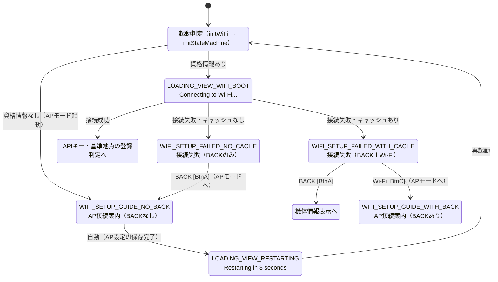
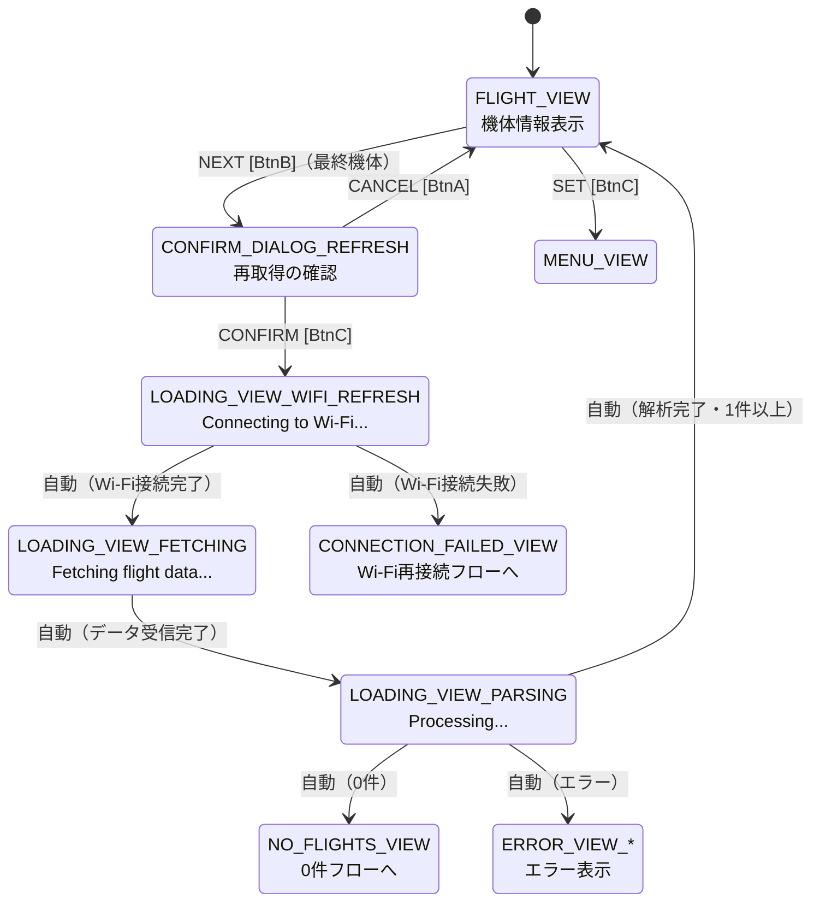
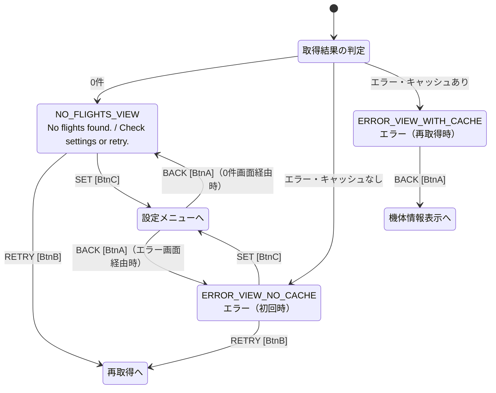
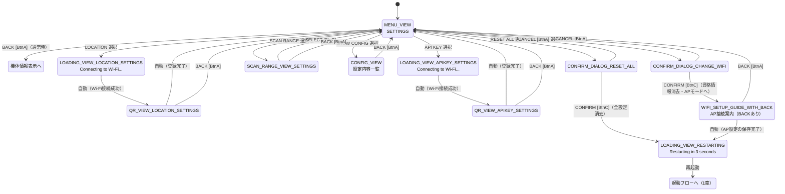
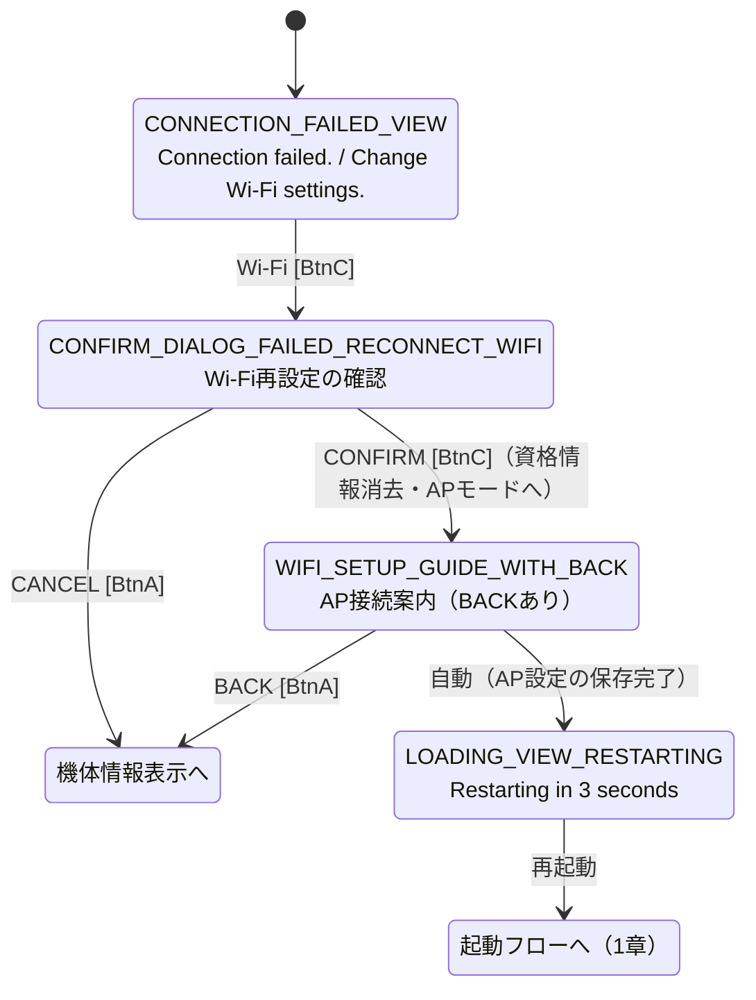

# 画面遷移設計：M5Stack 航空機スキャンシステム

**更新日時：2026-08-20**

本ドキュメントは、Figmaで作成したプロトタイプから抽出した画面遷移を、Mermaid形式の状態遷移図としてまとめたものである。実装時（`state_machine.cpp`）の参照資料として使用する。

**表記の凡例**

| 表記 | 意味 |
|---|---|
| `[BtnA]` `[BtnB]` `[BtnC]` | 物理ボタンの押下（左／中央／右） |
| `自動` | 処理完了による自動遷移（プロトタイプ上はアフターディレイで表現） |
| `再起動` | `ESP.restart()`による実機再起動を挟む遷移（1章参照） |
| 破線 | 別フローへの合流 |

---

## 1. 起動フロー

**手順25（Wi-Fi設定関連画面）の実装に伴い、本章は全面的に改訂した。**

Wi-Fi設定の保存後は`ESP.restart()`による再起動を挟む方式を採用している（プロジェクト仕様書3.2.2参照）。そのため本章の流れは、初回起動時だけでなく、**Wi-Fi設定完了後の再起動時・通常の電源投入時のすべてに共通する**。

**補足**

* **接続成功画面（旧`WIFI_SETUP_SUCCESS_*`）は廃止した。** 再起動を挟むと「Wi-Fi設定直後の起動」と「通常の電源投入」を状態から区別できず、そのまま表示すると通常起動のたびに`NEXT`押下を強いることになるためである。接続成功時に利用者が対応すべきことはなく、IPアドレスはCONFIG画面（5.7.1参照）から確認できる。
* **接続中画面（`LOADING_VIEW_WIFI_BOOT`）は起動時共通の1画面とした。** 旧設計では遷移元ごとに`LOADING_VIEW_WIFI_SETUP_INIT`/`_SETTINGS`/`_RECONNECT`の3画面に分かれていたが、再起動を挟むため文脈は失われる。`initWiFi()`は最大60秒ブロックするため、この間の無反応を避ける目的で`main.cpp`が`initWiFi()`の直前に描画する。
* **接続失敗画面はキャッシュの有無で2種類に分かれる。** キャッシュがあれば`BACK`で機体情報表示へ戻れる（ルータ停止等の一時的な障害で手元のデータすら見られなくなることを避けるため）。キャッシュがない場合は戻り先がないため、`BACK`はAPモードへの再入力となる。
* **`Wi-Fi`（BtnC）押下後のAP接続案内は`WIFI_SETUP_GUIDE_WITH_BACK`となる。** キャッシュがある＝機体情報表示へ戻れる状態であるため、再起動で失われた遷移元の文脈をキャッシュの有無から補い、再接続フロー（5章）と同じ扱いとする。
* 資格情報を消さずにAPモードへ入り直す点に注意（接続失敗が一時的な障害である可能性を考慮）。資格情報を消去するのは、利用者が明示的にネットワーク切り替えを選択した場合（4章・5章の確認ダイアログでCONFIRM）のみである。
* APIキー・基準地点の登録状況による分岐は8.2-Dで実装予定。現時点では、Wi-Fi接続成功時に`main.cpp`の一時テストコードが機体情報を取得して`FLIGHT_VIEW`へ遷移させている。

---

## 2. 通常操作フロー（データ取得）

機体情報表示を起点とした、データ再取得の流れ。

**補足**

* `PREV`（BtnA）は同一画面内での機体送りのため、画面遷移は発生しない。1機目で押した場合は最終機体へループする（5.2参照）。
* `NEXT`は最終機体で押した場合のみ確認ダイアログへ遷移する。それ以外は同一画面内での機体送り。
* ローディング画面からの分岐（成功／0件／エラー）は、プロトタイプ上は成功パターンのみ設定されている。
* `LOADING_WIFI_REFRESH`からの`CONNECTION_FAILED_VIEW`への遷移（Wi-Fi再接続フロー、5章参照）は、**手順25で本実装済み**。従来の暫定措置（`ERROR_VIEW`への遷移）は解消された。

---

## 3. エラー・0件フロー

データ取得の結果が正常でなかった場合の流れ。

**補足**

* 0件画面・エラー画面は、いずれも実装上は1画面（`SystemMode`は1つ）であり、状態に応じて表示内容とボタンを出し分ける（5.10参照）。
* 0件画面は当初SCAN RANGE設定（NARROW/WIDE）で表示・ボタンを出し分ける設計だったが、機体0件の解決策はSCAN RANGE変更に限らないため、`SET`（SETTINGSへ）に一本化する設計に変更した。これに伴い、0件画面からSCAN RANGE選択画面への直接遷移（`RANGE`ボタン）は廃止した。
* `MENU_VIEW`の`BACK`は、遷移元（FLIGHT_VIEW／0件画面／エラー画面）によって戻り先が変わる（`MenuCaller`、4章・プロジェクト仕様書5.7参照）。
* `NO_FLIGHTS_VIEW`・`ERROR_VIEW_NO_CACHE`とも、`RETRY`は確認ダイアログを挟まない。
* **Wi-Fi接続失敗時にエラー画面を流用する暫定措置は、手順25で解消された。** データ再取得時の接続失敗は`CONNECTION_FAILED_VIEW`（5章）、起動時の接続失敗は`WIFI_SETUP_FAILED_*`（1章）へ遷移する。

---

## 4. 設定操作フロー

設定メニューを起点とした各種設定の流れ。

**補足**

* `MENU_VIEW`の`BACK`は、本図では通常時（FLIGHT_VIEWから遷移してきた場合）のみを示す。0件画面・エラー画面（キャッシュなし）から遷移してきた場合は、それぞれの画面に戻る（3章参照）。
* **`CONFIRM_DIALOG_RESET_ALL`の`CONFIRM`は、全設定・キャッシュを消去した後、再起動予告画面を3秒表示してから再起動する。** 再起動後は資格情報が存在しないため、起動フロー（1章）によりAP接続案内画面が表示される。
* **`CONFIRM_DIALOG_CHANGE_WIFI`の`CONFIRM`は、資格情報・ネットワーク設定を消去してAPモードへ移行する**（`resetAndEnterAPMode()`）。利用者が明示的に別ネットワークへの切り替えを選択したケースであるため、消去してよいと判断している。
* **AP接続案内画面で`BACK`を押して中断した場合、資格情報は既に消去済みである。** 確認ダイアログで「The current connection will be disconnected.」と警告済みではあるが、この状態でSETTINGSへ戻ると未設定のまま運用が続く点に注意すること。
* 設定画面から遷移した`QR_VIEW_*`には`BACK`を表示する（初回起動時との違い、5.8参照）。
* `SCAN_RANGE_VIEW_SETTINGS`は`SELECT`後もSETTINGSに戻る（再取得しない）。
* **`API KEY`・`LOCATION`選択時はローディング画面を経由する**。QRコード画面に表示するURLは`WiFi.localIP()`で取得したIPアドレスを含むため、**Wi-Fi接続が完了していないとURLが確定しない**ためである。通常時はWi-Fi OFF（3.5参照）のため、これらの設定項目を選択した時点で接続処理が必要になる。
* 設定完了後（または`BACK`でキャンセル後）はWi-Fiを切断する。

---

## 5. Wi-Fi再接続フロー

データ再取得時にWi-Fi接続が失敗した場合の流れ。

**補足**

* **再接続成功後に再取得の確認ダイアログを表示する設計は廃止した。** 接続成功画面の廃止（1章参照）に伴い、AP設定完了後は再起動して起動フローへ合流するため、再接続完了時点で「再取得するかどうか」を問う画面が存在しなくなったためである。再取得が必要な場合は、機体情報表示から通常の再取得操作（2章）を行う。
* `CONNECTION_FAILED_VIEW`には`BACK`を設けない。機体情報表示へ戻る動線は、`Wi-Fi`押下後の確認ダイアログの`CANCEL`が担う。
* この画面はデータ再取得時にのみ出現するため、キャッシュは必ず存在する。したがって`WIFI_SETUP_FAILED_*`のようなキャッシュ有無による出し分けは行わない。
* `CONNECTION_FAILED_VIEW`と`WIFI_SETUP_FAILED_*`は、いずれも「接続失敗」を伝える画面だが**別画面である**。前者はタイトルなし・本文2行・`Wi-Fi`ボタンのみ、後者はタイトルあり・本文1行・`BACK`（＋`Wi-Fi`）という構成の違いがある。

---

## 6. 実装時の留意点

**① 同一画面内の状態変化は本図に含まない**

以下は`SystemMode`が変化しないため、状態遷移図には現れない。

* `FLIGHT_VIEW`の`PREV`/`NEXT`による機体送り（最終機体での`NEXT`を除く）
* `MENU_VIEW`・`SCAN_RANGE_VIEW`の`DOWN`によるカーソル移動
* `MODE_WIFI_SETUP`内での表示フェーズの切り替え（`WiFiSetupPhase`）。AP接続案内と接続失敗は同一の`SystemMode`であり、フェーズ変数で描画とボタン処理を分岐する

**② 実装上は1つでも、プロトタイプでは複数に分かれている画面がある**

| 実装上の画面 | プロトタイプ上のフレーム |
|---|---|
| QRコード誘導（APIキー） | `_INIT` / `_SETTINGS` |
| QRコード誘導（基準地点） | `_INIT` / `_SETTINGS` |
| AP接続案内 | `WIFI_SETUP_GUIDE_NO_BACK` / `_WITH_BACK`（BACKの有無のみが異なる） |
| Wi-Fi接続失敗 | `WIFI_SETUP_FAILED_NO_CACHE` / `_WITH_CACHE`（ボタン構成のみが異なる） |
| ローディング | 文脈ごとに複数 |
| 確認ダイアログ | `_REFRESH` / `_CHANGE_WIFI` / `_RESET_ALL` / `_FAILED_RECONNECT_WIFI` |
| エラー | `_NO_CACHE` / `_WITH_CACHE` |

いずれも共通の描画関数に引数を渡す、または状態で分岐する形で実装する。

**③ 遷移元による分岐の記録方法**

AP接続案内画面の`BACK`は、遷移元によって戻り先が変わる。`ConfirmTarget`・`MenuCaller`と同じ考え方で、`WiFiSetupCaller`（`_INIT` / `_SETTINGS` / `_RECONNECT`）を用意して分岐する。

ただし**この変数は再起動をまたいで保持されない**（メモリ上の変数であり、NVS等へは保存しない）。再起動後に接続失敗画面から`Wi-Fi`で入り直した場合は、キャッシュの有無から`_RECONNECT`として扱う（1章補足参照）。

**④ 手順25で廃止した画面**

| 廃止した画面 | 理由 |
|---|---|
| `WIFI_SETUP_SUCCESS_INIT` / `_SETTINGS` / `_RECONNECT` | 再起動を挟むと通常起動と区別できず、毎回`NEXT`押下を強いるため（1章参照） |
| `LOADING_VIEW_WIFI_SETUP_INIT` / `_SETTINGS` / `_RECONNECT` | 起動時共通の`LOADING_VIEW_WIFI_BOOT`へ集約 |
| `WIFI_SETUP_RECONNECT` | `WIFI_SETUP_GUIDE_WITH_BACK`と同一のため統合 |
| `WIFI_SETUP_FAILED_RECONNECT` | `WIFI_SETUP_FAILED_*`（キャッシュ有無）へ再編 |

---

## 7. 遷移表

`state_machine.cpp`の実装と対応する、全遷移の一覧（56件）。

### 7.1 ボタン操作による遷移（35件）

| 遷移元 | ボタン | 位置 | 遷移先 |
|---|---|---|---|
| **FLIGHT_VIEW** | NEXT（最終機体） | BtnB | CONFIRM_DIALOG_REFRESH |
| FLIGHT_VIEW | SET | BtnC | MENU_VIEW |
| **MENU_VIEW** | BACK（FLIGHT_VIEW経由時） | BtnA | FLIGHT_VIEW |
| MENU_VIEW | BACK（0件画面経由時） | BtnA | NO_FLIGHTS_VIEW |
| MENU_VIEW | BACK（エラー画面経由時） | BtnA | ERROR_VIEW_NO_CACHE |
| MENU_VIEW | SELECT（LOCATION） | BtnC | LOADING_VIEW_LOCATION_SETTINGS |
| MENU_VIEW | SELECT（API KEY） | BtnC | LOADING_VIEW_APIKEY_SETTINGS |
| MENU_VIEW | SELECT（Wi-Fi） | BtnC | CONFIRM_DIALOG_CHANGE_WIFI |
| MENU_VIEW | SELECT（SCAN RANGE） | BtnC | SCAN_RANGE_VIEW_SETTINGS |
| MENU_VIEW | SELECT（SHOW CONFIG） | BtnC | CONFIG_VIEW |
| MENU_VIEW | SELECT（RESET ALL） | BtnC | CONFIRM_DIALOG_RESET_ALL |
| **CONFIG_VIEW** | BACK | BtnA | MENU_VIEW |
| **SCAN_RANGE_VIEW_SETTINGS** | BACK | BtnA | MENU_VIEW |
| SCAN_RANGE_VIEW_SETTINGS | SELECT | BtnC | MENU_VIEW |
| **NO_FLIGHTS_VIEW** | RETRY | BtnB | LOADING_VIEW_WIFI_REFRESH |
| NO_FLIGHTS_VIEW | SET | BtnC | MENU_VIEW |
| **ERROR_VIEW_NO_CACHE** | RETRY | BtnB | LOADING_VIEW_WIFI_REFRESH |
| ERROR_VIEW_NO_CACHE | SET | BtnC | MENU_VIEW |
| **ERROR_VIEW_WITH_CACHE** | BACK | BtnA | FLIGHT_VIEW |
| **CONFIRM_DIALOG_REFRESH** | CANCEL | BtnA | FLIGHT_VIEW |
| CONFIRM_DIALOG_REFRESH | CONFIRM | BtnC | LOADING_VIEW_WIFI_REFRESH |
| **CONFIRM_DIALOG_CHANGE_WIFI** | CANCEL | BtnA | MENU_VIEW |
| CONFIRM_DIALOG_CHANGE_WIFI | CONFIRM | BtnC | WIFI_SETUP_GUIDE_WITH_BACK（資格情報消去後） |
| **CONFIRM_DIALOG_RESET_ALL** | CANCEL | BtnA | MENU_VIEW |
| CONFIRM_DIALOG_RESET_ALL | CONFIRM | BtnC | LOADING_VIEW_RESTARTING（全設定消去後） |
| **CONFIRM_DIALOG_FAILED_RECONNECT_WIFI** | CANCEL | BtnA | FLIGHT_VIEW |
| CONFIRM_DIALOG_FAILED_RECONNECT_WIFI | CONFIRM | BtnC | WIFI_SETUP_GUIDE_WITH_BACK（資格情報消去後） |
| **CONNECTION_FAILED_VIEW** | Wi-Fi | BtnC | CONFIRM_DIALOG_FAILED_RECONNECT_WIFI |
| **WIFI_SETUP_GUIDE_WITH_BACK** | BACK（SETTINGS経由時） | BtnA | MENU_VIEW |
| WIFI_SETUP_GUIDE_WITH_BACK | BACK（再接続経由時） | BtnA | FLIGHT_VIEW |
| **WIFI_SETUP_FAILED_NO_CACHE** | BACK | BtnA | WIFI_SETUP_GUIDE_NO_BACK（APモードへ） |
| **WIFI_SETUP_FAILED_WITH_CACHE** | BACK | BtnA | FLIGHT_VIEW |
| WIFI_SETUP_FAILED_WITH_CACHE | Wi-Fi | BtnC | WIFI_SETUP_GUIDE_WITH_BACK（APモードへ） |
| **QR_VIEW_APIKEY_SETTINGS** | BACK | BtnA | MENU_VIEW |
| **QR_VIEW_LOCATION_SETTINGS** | BACK | BtnA | MENU_VIEW |

※`WIFI_SETUP_GUIDE_NO_BACK`にはボタンを設けない。初回起動時は戻り先が存在しないため。

### 7.2 処理完了・再起動による自動遷移（21件）

| 遷移元 | 契機 | 遷移先 |
|---|---|---|
| **起動判定** | 資格情報なし | WIFI_SETUP_GUIDE_NO_BACK（APモード起動） |
| 起動判定 | 資格情報あり | LOADING_VIEW_WIFI_BOOT |
| **LOADING_VIEW_WIFI_BOOT** | Wi-Fi接続成功 | APIキー・基準地点の登録判定へ（8.2-Dで実装） |
| LOADING_VIEW_WIFI_BOOT | 接続失敗・キャッシュなし | WIFI_SETUP_FAILED_NO_CACHE |
| LOADING_VIEW_WIFI_BOOT | 接続失敗・キャッシュあり | WIFI_SETUP_FAILED_WITH_CACHE |
| **WIFI_SETUP_GUIDE_NO_BACK** | AP設定の保存完了 | LOADING_VIEW_RESTARTING |
| **WIFI_SETUP_GUIDE_WITH_BACK** | 同上 | LOADING_VIEW_RESTARTING |
| **LOADING_VIEW_RESTARTING** | 3秒経過 | 再起動 → 起動判定へ |
| **QR_VIEW_APIKEY_INIT** | APIキー登録・検証成功 | QR_VIEW_LOCATION_INIT |
| **QR_VIEW_LOCATION_INIT** | 基準地点登録完了 | LOADING_VIEW_WIFI_REFRESH |
| **LOADING_VIEW_APIKEY_SETTINGS** | Wi-Fi接続成功 | QR_VIEW_APIKEY_SETTINGS |
| **LOADING_VIEW_LOCATION_SETTINGS** | Wi-Fi接続成功 | QR_VIEW_LOCATION_SETTINGS |
| **QR_VIEW_APIKEY_SETTINGS** | APIキー登録・検証成功 | MENU_VIEW（Wi-Fi切断） |
| **QR_VIEW_LOCATION_SETTINGS** | 基準地点登録完了 | MENU_VIEW（Wi-Fi切断） |
| **LOADING_VIEW_WIFI_REFRESH** | Wi-Fi接続成功 | LOADING_VIEW_FETCHING |
| LOADING_VIEW_WIFI_REFRESH | Wi-Fi接続失敗 | CONNECTION_FAILED_VIEW |
| **LOADING_VIEW_FETCHING** | データ受信完了 | LOADING_VIEW_PARSING |
| LOADING_VIEW_FETCHING | 通信エラー | ERROR_VIEW_* |
| **LOADING_VIEW_PARSING** | 解析完了（1件以上） | FLIGHT_VIEW |
| LOADING_VIEW_PARSING | 解析完了（0件） | NO_FLIGHTS_VIEW |
| LOADING_VIEW_PARSING | 解析失敗 | ERROR_VIEW_* |

※`LOADING_VIEW_WIFI_BOOT`は、`main.cpp`が`initWiFi()`の直前に描画する。`initWiFi()`は最大60秒ブロックするため、この間の無反応を避ける目的である。

※`LOADING_VIEW_RESTARTING`は`web_handler.cpp`の`handleSave()`と`state_machine.cpp`の`executeResetAll()`の2箇所から描画される。表示秒数と`delay()`の値は必ず一致させること。

※`LOADING_VIEW_APIKEY_SETTINGS`・`LOADING_VIEW_LOCATION_SETTINGS`は、**QRコード画面を表示する前のWi-Fi接続**を表す。QRコードに埋め込むURLは`WiFi.localIP()`で取得したIPアドレスを含むため、接続完了までURLが確定しないためである。

### 7.3 同一画面内の操作（画面遷移なし）

| 画面 | ボタン | 動作 |
|---|---|---|
| FLIGHT_VIEW | PREV（BtnA） | 前の機体を表示。1機目では最終機体へループ |
| FLIGHT_VIEW | NEXT（BtnB） | 次の機体を表示。最終機体では確認ダイアログへ遷移 |
| MENU_VIEW | DOWN（BtnB） | カーソルを下へ移動。最下段で最上段に戻る |
| SCAN_RANGE_VIEW_* | DOWN（BtnB） | カーソルを下へ移動 |
