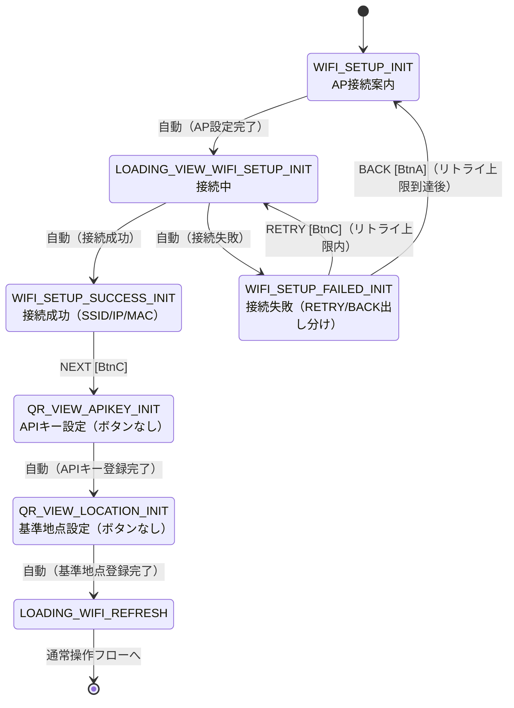
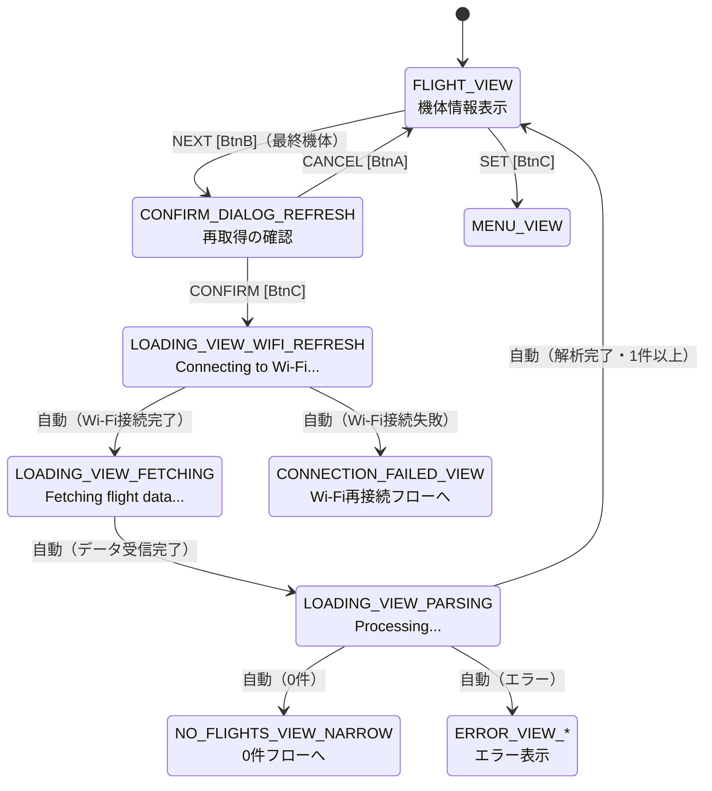
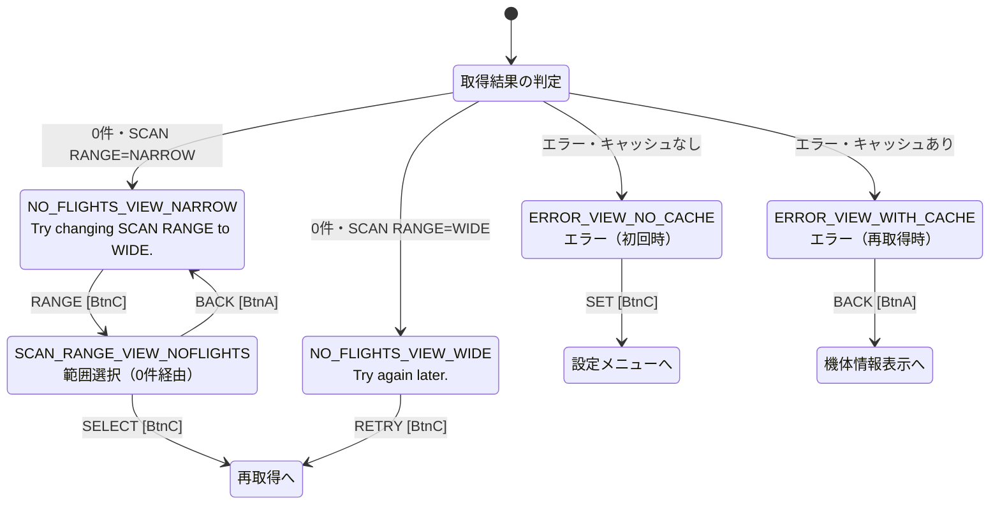
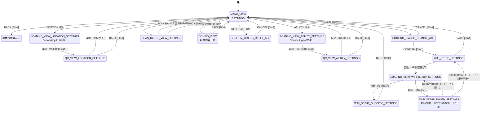
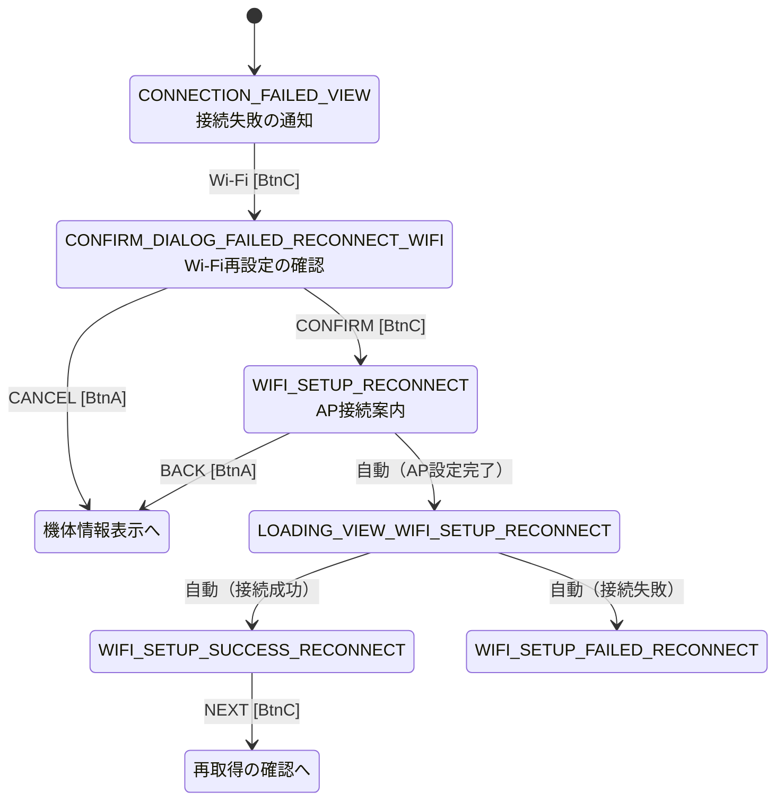

# 画面遷移設計：M5Stack 航空機スキャンシステム

**更新日時：2026-08-11**

本ドキュメントは、Figmaで作成したプロトタイプから抽出した画面遷移を、Mermaid形式の状態遷移図としてまとめたものである。実装時（`state_machine.cpp`）の参照資料として使用する。

**表記の凡例**

| 表記 | 意味 |
|---|---|
| `[BtnA]` `[BtnB]` `[BtnC]` | 物理ボタンの押下（左／中央／右） |
| `自動` | 処理完了による自動遷移（プロトタイプ上はアフターディレイで表現） |
| 破線 | 別フローへの合流 |

---

## 1. 初回起動フロー

初回起動時、Wi-Fi資格情報・APIキー・基準地点がいずれも未設定の状態から、機体情報表示に至るまでの流れ。

**補足**
* `QR_VIEW_*_INIT`にはボタンを設けない。APIキー・基準地点は動作に必須であり、未設定のまま進める手段を用意しないため（5.8参照）。
* 初回設定完了後は確認ダイアログを挟まず、直接データ取得へ進む（5.7.2参照）。
* `WIFI_SETUP_FAILED_INIT`は、リトライ回数（プロジェクト仕様書3.1.2参照）に応じて`RETRY`／`BACK`を出し分ける。`RETRY`の場合は`LOADING_VIEW_WIFI_SETUP_INIT`へ戻り、再度接続試行する。`BACK`の場合は`WIFI_SETUP_INIT`（入力フォーム）へ戻る。

---

## 2. 通常操作フロー（データ取得）

機体情報表示を起点とした、データ再取得の流れ。

**補足**
* `PREV`（BtnA）は同一画面内での機体送りのため、画面遷移は発生しない。1機目で押した場合は最終機体へループする（5.2参照）。
* `NEXT`は最終機体で押した場合のみ確認ダイアログへ遷移する。それ以外は同一画面内での機体送り。
* ローディング画面からの分岐（成功／0件／エラー）は、プロトタイプ上は成功パターンのみ設定されている。

---

## 3. エラー・0件フロー

データ取得の結果が正常でなかった場合の流れ。

**補足**
* 0件画面・エラー画面は、いずれも実装上は1画面（`SystemMode`は1つ）であり、状態に応じて表示内容とボタンを出し分ける（5.10参照）。
* `SCAN_RANGE_VIEW`は遷移元によって`SELECT`後の動作が変わる（5.7.3参照）。0件画面から来た場合はそのまま再取得へ進む。
* `NO_FLIGHTS_VIEW_WIDE`の`RETRY`は確認ダイアログを挟まない。

---

## 4. 設定操作フロー

設定メニューを起点とした各種設定の流れ。

**補足**
* `CONFIRM_DIALOG_RESET_ALL`の`CONFIRM`は、全設定（Wi-Fi情報・APIキー・基準地点）および機体情報キャッシュを消去した上で初回起動フローへ遷移する。
* 設定画面から遷移した`QR_VIEW_*`には`BACK`を表示する（初回起動時との違い、5.8参照）。
* `SCAN_RANGE_VIEW_SETTINGS`は`SELECT`後もSETTINGSに戻る（再取得しない）。
* **`API KEY`・`LOCATION`選択時はローディング画面を経由する**。QRコード画面に表示するURLは`WiFi.localIP()`で取得したIPアドレスを含むため、**Wi-Fi接続が完了していないとURLが確定しない**ためである。通常時はWi-Fi OFF（3.5参照）のため、これらの設定項目を選択した時点で接続処理が必要になる。
* 設定完了後（または`BACK`でキャンセル後）はWi-Fiを切断する。

---

## 5. Wi-Fi再接続フロー

データ再取得時にWi-Fi接続が失敗した場合の流れ。

**補足**
* Wi-Fi再接続成功後は、改めて再取得の確認ダイアログを表示する。Wi-Fi設定という別作業を挟んでいるため、意図の再確認を行う位置づけである。
* `WIFI_SETUP_FAILED_RECONNECT`の`BACK`は、プロトタイプ上は遷移先未設定。

---

## 6. 実装時の留意点

**① 同一画面内の状態変化は本図に含まない**

以下は`SystemMode`が変化しないため、状態遷移図には現れない。

* `FLIGHT_VIEW`の`PREV`/`NEXT`による機体送り（最終機体での`NEXT`を除く）
* `MENU_VIEW`・`SCAN_RANGE_VIEW`の`DOWN`によるカーソル移動

**② 実装上は1つでも、プロトタイプでは複数に分かれている画面がある**

| 実装上の画面 | プロトタイプ上のフレーム |
|---|---|
| QRコード誘導（APIキー） | `_INIT` / `_SETTINGS` |
| QRコード誘導（基準地点） | `_INIT` / `_SETTINGS` |
| Wi-Fi設定（3画面） | `_INIT` / `_SETTINGS` / `_RECONNECT` |
| Wi-Fi接続失敗画面（RETRY/BACK出し分け） | `_INIT` / `_INIT_LIMIT` / `_SETTINGS` / `_SETTINGS_LIMIT`（`_RECONNECT`はリトライ対象外のため1枚のまま） |
| ローディング | 文脈ごとに複数 |
| 確認ダイアログ | `_REFRESH` / `_CHANGE_WIFI` / `_RESET_ALL` / `_FAILED_RECONNECT_WIFI` |
| 機体0件 | `_NARROW` / `_WIDE` |
| エラー | `_NO_CACHE` / `_WITH_CACHE` |
| SCAN RANGE選択 | `_SETTINGS` / `_NOFLIGHTS` |

いずれも共通の描画関数に引数を渡す、または状態で分岐する形で実装する。

**③ 遷移の網羅性**

プロトタイプ上のすべてのボタン・自動遷移に遷移先が定義されている（未設定箇所なし）。詳細は7章の遷移表を参照。

---

## 7. 遷移表

`state_machine.cpp`の実装と対応する、全遷移の一覧（54件）。

### 7.1 ボタン操作による遷移（37件）

| 遷移元 | ボタン | 位置 | 遷移先 |
|---|---|---|---|
| **FLIGHT_VIEW** | NEXT（最終機体） | BtnB | CONFIRM_DIALOG_REFRESH |
| FLIGHT_VIEW | SET | BtnC | MENU_VIEW |
| **MENU_VIEW** | BACK | BtnA | FLIGHT_VIEW |
| MENU_VIEW | SELECT（LOCATION） | BtnC | LOADING_VIEW_LOCATION_SETTINGS |
| MENU_VIEW | SELECT（API KEY） | BtnC | LOADING_VIEW_APIKEY_SETTINGS |
| MENU_VIEW | SELECT（Wi-Fi） | BtnC | CONFIRM_DIALOG_CHANGE_WIFI |
| MENU_VIEW | SELECT（SCAN RANGE） | BtnC | SCAN_RANGE_VIEW_SETTINGS |
| MENU_VIEW | SELECT（SHOW CONFIG） | BtnC | CONFIG_VIEW |
| MENU_VIEW | SELECT（RESET ALL） | BtnC | CONFIRM_DIALOG_RESET_ALL |
| **CONFIG_VIEW** | BACK | BtnA | MENU_VIEW |
| **SCAN_RANGE_VIEW_SETTINGS** | BACK | BtnA | MENU_VIEW |
| SCAN_RANGE_VIEW_SETTINGS | SELECT | BtnC | MENU_VIEW |
| **SCAN_RANGE_VIEW_NOFLIGHTS** | BACK | BtnA | NO_FLIGHTS_VIEW_NARROW |
| SCAN_RANGE_VIEW_NOFLIGHTS | SELECT | BtnC | LOADING_VIEW_WIFI_REFRESH |
| **NO_FLIGHTS_VIEW_NARROW** | RANGE | BtnC | SCAN_RANGE_VIEW_NOFLIGHTS |
| **NO_FLIGHTS_VIEW_WIDE** | RETRY | BtnC | LOADING_VIEW_WIFI_REFRESH |
| **ERROR_VIEW_NO_CACHE** | SET | BtnC | MENU_VIEW |
| **ERROR_VIEW_WITH_CACHE** | BACK | BtnA | FLIGHT_VIEW |
| **CONFIRM_DIALOG_REFRESH** | CANCEL | BtnA | FLIGHT_VIEW |
| CONFIRM_DIALOG_REFRESH | CONFIRM | BtnC | LOADING_VIEW_WIFI_REFRESH |
| **CONFIRM_DIALOG_CHANGE_WIFI** | CANCEL | BtnA | MENU_VIEW |
| CONFIRM_DIALOG_CHANGE_WIFI | CONFIRM | BtnC | WIFI_SETUP_SETTINGS |
| **CONFIRM_DIALOG_RESET_ALL** | CANCEL | BtnA | MENU_VIEW |
| CONFIRM_DIALOG_RESET_ALL | CONFIRM | BtnC | WIFI_SETUP_INIT（全設定消去後） |
| **CONFIRM_DIALOG_FAILED_RECONNECT_WIFI** | CANCEL | BtnA | FLIGHT_VIEW |
| CONFIRM_DIALOG_FAILED_RECONNECT_WIFI | CONFIRM | BtnC | WIFI_SETUP_RECONNECT |
| **CONNECTION_FAILED_VIEW** | Wi-Fi | BtnC | CONFIRM_DIALOG_FAILED_RECONNECT_WIFI |
| **WIFI_SETUP_SETTINGS** | BACK | BtnA | MENU_VIEW |
| **WIFI_SETUP_RECONNECT** | BACK | BtnA | FLIGHT_VIEW |
| **WIFI_SETUP_SUCCESS_INIT** | NEXT | BtnC | QR_VIEW_APIKEY_INIT |
| **WIFI_SETUP_SUCCESS_SETTINGS** | NEXT | BtnC | MENU_VIEW |
| **WIFI_SETUP_SUCCESS_RECONNECT** | NEXT | BtnC | CONFIRM_DIALOG_REFRESH |
| **WIFI_SETUP_FAILED_INIT** | RETRY（リトライ上限内） | BtnC | LOADING_VIEW_WIFI_SETUP_INIT |
| WIFI_SETUP_FAILED_INIT | BACK（リトライ上限到達後） | BtnA | WIFI_SETUP_INIT |
| **WIFI_SETUP_FAILED_SETTINGS** | RETRY（リトライ上限内） | BtnC | LOADING_VIEW_WIFI_SETUP_SETTINGS |
| WIFI_SETUP_FAILED_SETTINGS | BACK（リトライ上限到達後） | BtnA | WIFI_SETUP_SETTINGS |
| **WIFI_SETUP_FAILED_RECONNECT** | BACK | BtnA | WIFI_SETUP_RECONNECT |
| **QR_VIEW_APIKEY_SETTINGS** | BACK | BtnA | MENU_VIEW |
| **QR_VIEW_LOCATION_SETTINGS** | BACK | BtnA | MENU_VIEW |

### 7.2 処理完了による自動遷移（17件）

プロトタイプ上はアフターディレイで表現しているが、実装では**処理の完了**が遷移の契機となる。

| 遷移元 | 契機 | 遷移先 |
|---|---|---|
| **WIFI_SETUP_INIT** | AP設定の送信を受信 | LOADING_VIEW_WIFI_SETUP_INIT |
| **WIFI_SETUP_SETTINGS** | 同上 | LOADING_VIEW_WIFI_SETUP_SETTINGS |
| **WIFI_SETUP_RECONNECT** | 同上 | LOADING_VIEW_WIFI_SETUP_RECONNECT |
| **LOADING_VIEW_WIFI_SETUP_INIT** | Wi-Fi接続成功 | WIFI_SETUP_SUCCESS_INIT |
| LOADING_VIEW_WIFI_SETUP_INIT | Wi-Fi接続失敗 | WIFI_SETUP_FAILED_INIT |
| **LOADING_VIEW_WIFI_SETUP_SETTINGS** | Wi-Fi接続成功 | WIFI_SETUP_SUCCESS_SETTINGS |
| LOADING_VIEW_WIFI_SETUP_SETTINGS | Wi-Fi接続失敗 | WIFI_SETUP_FAILED_SETTINGS |
| **LOADING_VIEW_WIFI_SETUP_RECONNECT** | Wi-Fi接続成功 | WIFI_SETUP_SUCCESS_RECONNECT |
| LOADING_VIEW_WIFI_SETUP_RECONNECT | Wi-Fi接続失敗 | WIFI_SETUP_FAILED_RECONNECT |
| **QR_VIEW_APIKEY_INIT** | APIキー登録・検証成功 | QR_VIEW_LOCATION_INIT |
| **QR_VIEW_LOCATION_INIT** | 基準地点登録完了 | LOADING_VIEW_WIFI_REFRESH |
| **LOADING_VIEW_APIKEY_SETTINGS** | Wi-Fi接続成功 | QR_VIEW_APIKEY_SETTINGS |
| **LOADING_VIEW_LOCATION_SETTINGS** | Wi-Fi接続成功 | QR_VIEW_LOCATION_SETTINGS |
| **QR_VIEW_APIKEY_SETTINGS** | APIキー登録・検証成功 | MENU_VIEW（Wi-Fi切断） |
| **QR_VIEW_LOCATION_SETTINGS** | 基準地点登録完了 | MENU_VIEW（Wi-Fi切断） |
| **LOADING_VIEW_WIFI_REFRESH** | Wi-Fi接続成功 | LOADING_VIEW_FETCHING |
| LOADING_VIEW_WIFI_REFRESH | Wi-Fi接続失敗 | CONNECTION_FAILED_VIEW |
| **LOADING_VIEW_FETCHING** | データ受信完了 | LOADING_VIEW_PARSING |
| LOADING_VIEW_FETCHING | 通信エラー | ERROR_VIEW_* |
| **LOADING_VIEW_PARSING** | 解析完了（1件以上） | FLIGHT_VIEW |
| LOADING_VIEW_PARSING | 解析完了（0件） | NO_FLIGHTS_VIEW_* |
| LOADING_VIEW_PARSING | 解析失敗 | ERROR_VIEW_* |

※プロトタイプ上は成功パターンのみ設定されている。失敗・0件の分岐は実装時に定義する。

※`LOADING_VIEW_APIKEY_SETTINGS`・`LOADING_VIEW_LOCATION_SETTINGS`は、**QRコード画面を表示する前のWi-Fi接続**を表す。QRコードに埋め込むURLは`WiFi.localIP()`で取得したIPアドレスを含むため、接続完了までURLが確定しないためである。

### 7.3 同一画面内の操作（画面遷移なし）

| 画面 | ボタン | 動作 |
|---|---|---|
| FLIGHT_VIEW | PREV（BtnA） | 前の機体を表示。1機目では最終機体へループ |
| FLIGHT_VIEW | NEXT（BtnB） | 次の機体を表示。最終機体では確認ダイアログへ遷移 |
| MENU_VIEW | DOWN（BtnB） | カーソルを下へ移動。最下段で最上段に戻る |
| SCAN_RANGE_VIEW_* | DOWN（BtnB） | カーソルを下へ移動 |
